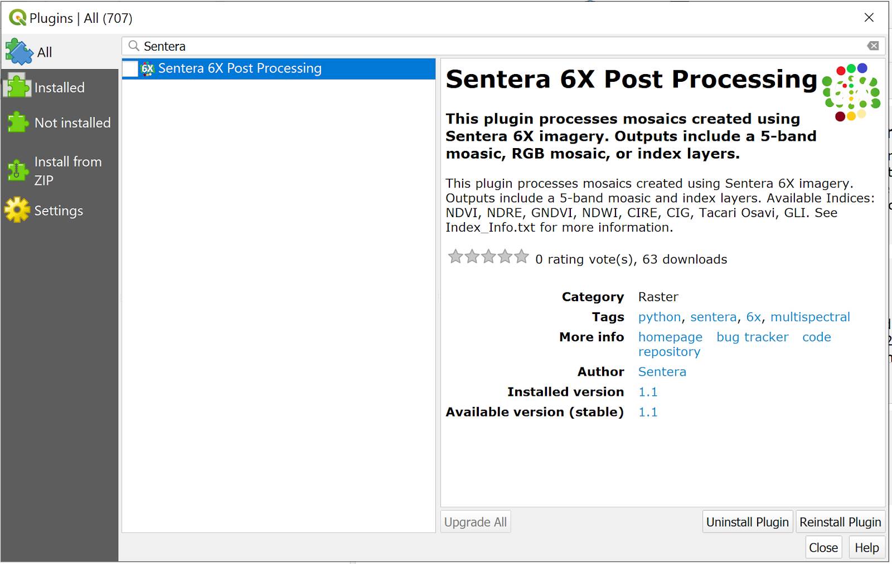

# 6X - Post Processing with QGIS Sentera Plugin

 <mark style="background-color:yellow;">When using a calibration panel, raw images should first be run through the calibrations script</mark>\
[<mark style="background-color:yellow;">6X - GitHub Link for Radiometric Corrections Script</mark>](https://support.sentera.com/portal/en/kb/articles/6x-github-link-for-radiometric-corrections-script)\
\ <mark style="background-color:yellow;">6X imagery can be stitched using either Pix4D or Metashape.</mark>\
[<mark style="background-color:yellow;">Pix4D Processing Instructions</mark>](https://support.sentera.com/portal/en/kb/articles/6x-how-to-process-in-pix4d)\
[<mark style="background-color:yellow;">Metashape Processing Instructions</mark>](https://support.sentera.com/portal/en/kb/articles/6x-how-to-process-data-from-6x-in-metashape)\

Install the Sentera QGIS Plugin\
 
-------------------------------------------------------------------------------------

To set up QGIS:\
1\.      Launch QGIS on Desktop.\
2\.      From the Plugins dropdown menu item, select Manage and Install Plugins. The Plugin dialog box displays.

<figure><figcaption></figcaption></figure>

3\.      Select All in the top left to display all plugins.\
4\.      Search for Sentera and select Sentera 6X Post Processing.

<figure><figcaption></figcaption></figure>

5. Click Install Plugin in the lower right.
6. Select Installed from the tabs on the left and ensure Processing and Sentera 6X Post Processing are both selected with check marks.
7. Click Close. The 6X icon should display as an option on the selection toolbar.

<figure><figcaption></figcaption></figure>

## Post Processing Steps

To process mosaics created using the 6X, perform the following steps:

1. Launch QGIS
2. Load 5 single band mosaics or 5-band mosaic into QGIS. The images will display in the Layers area.

<figure><figcaption></figcaption></figure>

3. Click the Sentera 6X Post Processing icon.

<figure><figcaption></figcaption></figure>

4. From the Input Type area, use the dropdown to select the five individual bands to match the Narrow Bands listed, or switch to the 5-band tab to use a 5-band mosaic as the input.

<figure><figcaption></figcaption></figure>

5. Select the desired output checkboxes in the Outputs area.&#x20;
6. Enter a name in the Output Base Name and confirm or navigate to the location of the Output Folder.
7. Click OK.
8. The selected outputs will be loaded into QGIS when processing is complete. The Layers area allows you to select layers to view in greater detail.
