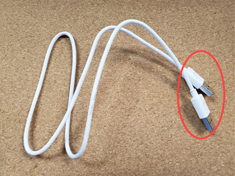
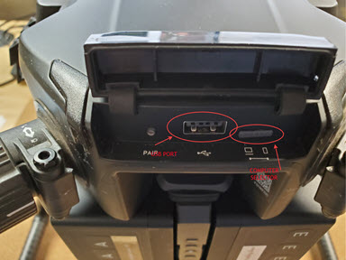
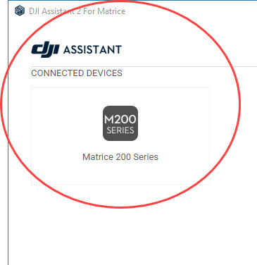
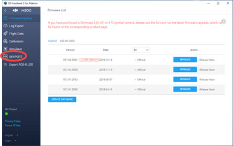
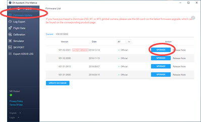

# DJI Equipment Setup & FIrmware Update

## Assembly 

Each DJI drone is different. Follow the instructions in your DJI Manual for specific steps for your drone.\

### Propellers 

Install the propellers. Note that half the propellers install clockwise and half install counterclockwise. In the photo below, propellers either have grey or black circles.

<figure><figcaption></figcaption></figure>

The black marking on the propeller matches the black dots on the motors.

1. Match the propeller with a corresponding motor. Each propeller works on 2 of 4 motors.
2. Press down and rotate to install.



### Arms 

Fold out and secure arms. Applies to all Mavic, M200, and M300 series drones.



### Gimbals 

Remove any piece securing a built-in gimbal. Applies to Mavic and Phantom series drones.



If you purchased a Sentera gimbal, remove it from the case and install it on the drone. Applies to Double 4K Lock & Go, Double 4K Skyport and gimballed 6X.

1. Match red and white dots.
2. Push up to insert.
3. Rotate to match red dots.



### Battery 

Install the battery or batteries.



Check the charge status of a battery by pressing the power button once quickly.



### Powering On  

Power on the drone by pressing the power button once and then again, holding for 3 seconds.



The same two press sequence is used on all DJI drones and controllers.



Fold out the antennas on the controller and power on using the same 2 press sequence. Press the power button once quickly and then again, holding down for 3 seconds.



## Connection 

### DJI App 

Download and launch the appropriate DJI app on your phone or tablet.

Check your DJI paper manual for the DJI application that corresponds to your drone.



**DJI Go 4**\
Phantom 4

Mavic 2

**DJI Pilot** (Android only)

M200

M210 (Cadence controller contains built-in Android tablet with DJI Pilot)

M300 (Controller contains built-in Android tablet with DJI Pilot)

**DJI Go**

M100

\
**Fly DJI**

Mavic 3

Connect one end of a USB cable to the controller and the other end to your mobile device.



### Recommended Cables  

 <mark style="background-color:red;">Sentera suggests only using Apple approved lightning or USB-C cables. 3rd party cables are known to cause connection issues and may pose a safety hazard.</mark>&#x20;

## Firmware Updates 

Check for updates in the DJI app. Click the top status bar to reveal any issues that might prevent takeoff.



### Phantom 4 Update Link 

DJI instructions for updating the firmware of the Phantom 4:\
[https://dl.djicdn.com/downloads/phantom\_4/en/Phantom\_4\_User\_Manual\_en\_v1.2\_20160805.pdf](https://dl.djicdn.com/downloads/phantom_4/en/Phantom_4_User_Manual_en_v1.2_20160805.pdf)\

### Inspire 1 Series or Phantom 3 

[http://dl.djicdn.com/downloads/inspire\_1/en/Firmware\_Update\_Guide\_en\_v1.4.pdf](http://dl.djicdn.com/downloads/inspire_1/en/Firmware_Update_Guide_en_v1.4.pdf)\

### M200 & M210 Firmware Update Process 

 <mark style="background-color:red;">If you have an M200V1 or an M210 V1 do not upgrade the firmware higher than Version 01.03.0009.</mark>\
\
[CLICK HERE](../double-4k/double-4k-updating-firmware.md) for directions on how to update your Double 4K Sensor firmware.\
\
DJI issues firmware updates regularly and it is necessary that these updates are applied to the Drone and SKYPORT©.  This solution is designed to provide you with instructions on how to do so.

1. Download DJI Assistant 2 for Matrice from DJI's website and then install it on your PC.&#x20;

 _<mark style="background-color:red;">You must be on the latest version DJI Assistant 2 for Matrice. Failure to do so could cause issues.</mark>_

&#x20;     a. [www.dji.com](http://www.dji.com/).\
&#x20;     b. Select Enterprise.\
&#x20;     c. Select Matrice 200 Series.\
&#x20;     d. Select Downloads.\
&#x20;     e. Find the DJI Assistant 2 for Matrice.\
&#x20;     f. Install the software to your computer.

2. Once installed launch DJI Assistant 2 for Matrice.
3. Plug the USB A to USB A cable into your PC. This cable must be plugged into your PC and not into a docking station or external Hub.  This cable came with the drone and should be in your case.

<figure><figcaption></figcaption></figure>

4. Plug the other end of the cable into the USB Port on the drone.

<figure><figcaption></figcaption></figure>

5. Ensure the Drone is in PC Mode.
6. Once the drone fully boots and is connected, DJI Assistant 2 will display this.

<figure><figcaption></figcaption></figure>

7. Click on the M200 Series icon to continue.
8. In the menu on the left click on SKYPORT.

<figure><figcaption></figcaption></figure>

 <mark style="background-color:red;">If you have an M200 V1 or an M210 V1 do not upgrade the Skyport firmware higher than Version 01.03.0009.</mark>&#x20;

9. Click Upgrade.
10. Once completed click on Firmware in the Menu on the left.
11. Verify the Aircraft is now on the latest firmware version.

<figure><figcaption></figcaption></figure>

12.) Once you are on the latest firmware you can close DJI Assistant 2 and then disconnect the cable from the drone.\
13.) Re-position the switch on the back of the drone to its original position.\
14.) Update the Double 4K using the instructions located at [Double 4K Firmware Update and Instructions](../double-4k/double-4k-updating-firmware.md).

 <mark style="background-color:red;">YOU MUST UPDATE YOUR DOUBLE 4K FIRMWARE WHEN UPDATING THE SKYPORT.  FAILURE TO UPDATE THE FIRMWARE OF YOUR DOUBLE 4K SENSOR AFTER THIS UPDATE WILL CAUSE YOUR DOUBLE 4K SENSOR TO FUNCTION INCORRECTLY.</mark>
