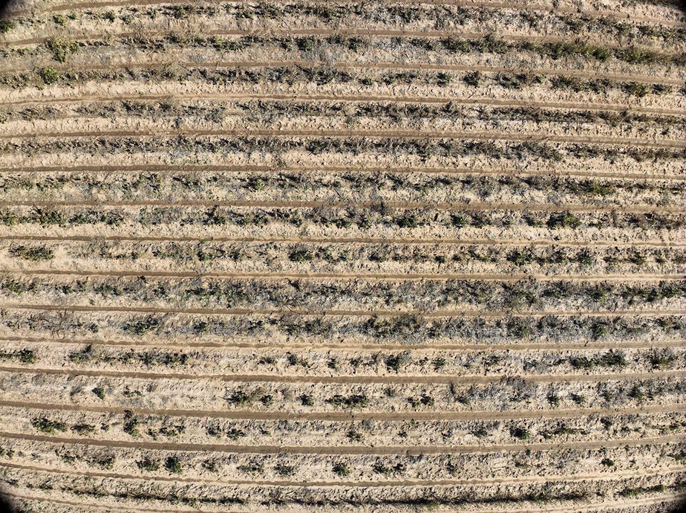

# Mavic 3 Enterprise Image Capture Settings for Spot Scout & Mosaics

The DJI Mavic 3 Enterprise ships with default settings that need to be changed before capturing data. Some settings vary by type of mission and will need to be adjusted between flights.

\
**Settings for all Missions**&#x20;

<table data-full-width="false"><thead><tr><th>Setting</th><th>Value</th></tr></thead><tbody><tr><td>Mechanical Shutter</td><td>Enabled</td></tr><tr><td>Image Ratio</td><td>4:3</td></tr><tr><td>Image Format</td><td>Jpeg</td></tr></tbody></table>

**Dewarping setting for Spot Scout and mosaic missions.**

| Mission Type | Dewarp             |
| ------------ | ------------------ |
| Mosaic       | Disabled           |
| Spot Scout   | 
Enabled 
 |

The process of creating an orthomosaic is able to account for warped images, while Spot Scout maps will simply display the warped images. Below are two images from the same field, with dewarping toggled off and on.&#x20;

|  |  |
| -------------------------------------------------------------------------- | --------------------------------------------------------------------------------------------------------------------------------------------------------------------------------------------------------------------------------- |
| Dewarping Disabled                                                         | Dewarping Enabled                                                                                                                                                                                                                 |

### To view and change settings:

1. Power on your drone and remote controller.&#x20;

<figure><figcaption></figcaption></figure>

2. Enter the Camera View.&#x20;

<figure><figcaption></figcaption></figure>

3. The settings bar is located at the top right of the screen. Click the settings icon on the far right side to access the camera menu.

<figure><figcaption></figcaption></figure>

4. The first tab, indicated by the camera icon, contains the image ratio and format settings.

<figure><figcaption></figcaption></figure>

a.  **Image Ratio:** This is set to 4:3 by default, meaning that the sensor will capture uncropped images. Different ratios will not utilize the full sensor. **Leave the ratio on 4:3.**

b. .png>) **Image Format:** This is set to RAW by default. **Change the image format to JPG.** The    JPG file format is required to process and analyze the images you capture.&#x20;

5. Click the three dots at the top of the menu to switch tabs and access more camera settings.&#x20;

<figure><figcaption></figcaption></figure>

a. .png>) **Mechanical Shutter:** This is turned off by default. **Make sure you toggle ON the mechanical shutter**, this helps to prevent image distortion.

b. .png>) **Dewarping:** This is turned off by default. Depending on your mission type you will need to change this setting. **Spot Scout missions require Dewarping to be enabled. Orthomosaic missions require Dewarping to be Disabled.**
