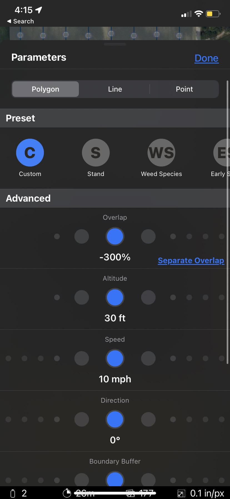

# FAQS - Can I perform Tassel Counts with my Mavic or Phantom?

 <mark style="background-color:red;">WARNING: Fly at your own risk. There are dangers of flying a drone at lower altitudes. Follow the directions below to carefully plan a safe and effective mission.</mark>\

Yes, tassel counts will work with the DJI Phantom 4 Pro or the DJI Mavic 2 Pro (with Hasselblad sensors). You can capture a tassel count with either a manual or autonomous flight. To ensure a safe and effective mission make sure you follow these guidelines:

* Images must be collected at 30 ft.
* The drone must be in your line of sight throughout the entire mission. Be prepared to respond to any obstacles or stop the mission.
* Water filled corn may disrupt Radio Frequencies. Be prepared to abort your mission if you view the drone behaving in an unusual manner.
* If you're flying over hilly terrain, use terrain informed following for autonomous flights, and make sure you launch from a high point in the field.
* Sentera will only run analytics on the center part of the image. P4Pro and Mavic 2 have high-quality imagers, but they are designed to have a wide field of view. That means that at the edge of the images, you will be looking at your field at about 45 degrees off of vertical (kind of "sideways"), so the resolution of each pixel isn't as high as would be generated by a camera with a narrow field of view.

If you find value in the tassel analytics product, there are Sentera and non-Sentera sensors that are designed to fly at much higher (safer) altitudes and collect tassel image data over many more acres per hour than these two systems. One such option is the Sentera Double 4K – Analytics Sensor on Sentera’s fixed wing PHX.

## Manual Flight Planning 

Manual tassel counts with a Phantom 4 Pro or Mavic 2 involves manually flying around the field with DJI Go 4 and capturing images at desired locations:&#x20;

1\. Takeoff using DJI Go 4 to a safe transit altitude.

2\. Transit out to the first location you would like to capture an image/sample.

3\. Lower the drone’s altitude while monitoring the video feed on your phone or tablet. Orient your drone such that:

* 10-15 rows are in frame.
* The rows are either horizontal or vertical in frame.

4\. Capture an image by pressing the image capture button either on your screen or on the physical controller.

<figure><figcaption></figcaption></figure>

5\. Ensure your drone’s altitude is safe for transit and move to another location on the field and capture another sample.

<figure><figcaption></figcaption></figure>

6\.  If you took off from the highest location on a field, your drone may read a negative altitude when capturing an image in a low area of the field.

<figure><figcaption></figcaption></figure>

7\. Repeat step 5 for as many samples as you wish to collect.

8\. Upload your imagery to FieldAgent on Desktop or Web to order a tassel count. Tassel counts may take up to 48 business hours to process.

## Autonomous Flight Planning 

### Settings 

Select the Custom Preset in FieldAgent on mobile. Then choose these Parameters:

* Overlap: -300%
* Altitude: 30 ft
* Speed: 10 mph

<figure><figcaption></figcaption></figure>

### Non-Flat Terrain 

When flying over non-flat terrain, Terrain Informed should be turned on.&#x20;

 <mark style="background-color:yellow;">**Note: that planning a terrain Informed flight requires an internet connection.**</mark>\
\
Toggle on Terrain Informed under the flight plan section:

<figure><figcaption></figcaption></figure>

### Obstacles 

 <mark style="background-color:red;">WARNING: You are responsible for planning and executing safe flights. Always check the flight area for trees and other obstacles. During flight, be prepared to take over at any time.</mark> \
\
  <mark style="background-color:red;">WARNING: Concave flight boundaries with surrounding trees at or near the planned altitude should be replanned as line missions.</mark>&#x20;

Look closely at planned flight routes before pressing launch. Some flight patterns over concave flight boundaries may cut through the boundaries. Cutting through the boundary is the most efficient path, but not always the safest. To solve this problem, clear the flight plan and, in the order the drone can safely fly, select all the locations where you would like to capture an image for stand count. Planning flights in this manner also makes it less likely that images are captured over areas where a tassel count may not be possible (ex. Over terracing or irrigation channels). See below for an example of a custom planned line flight that ensures the drone will not cross over trees while capturing photos.

<figure><figcaption></figcaption></figure>

