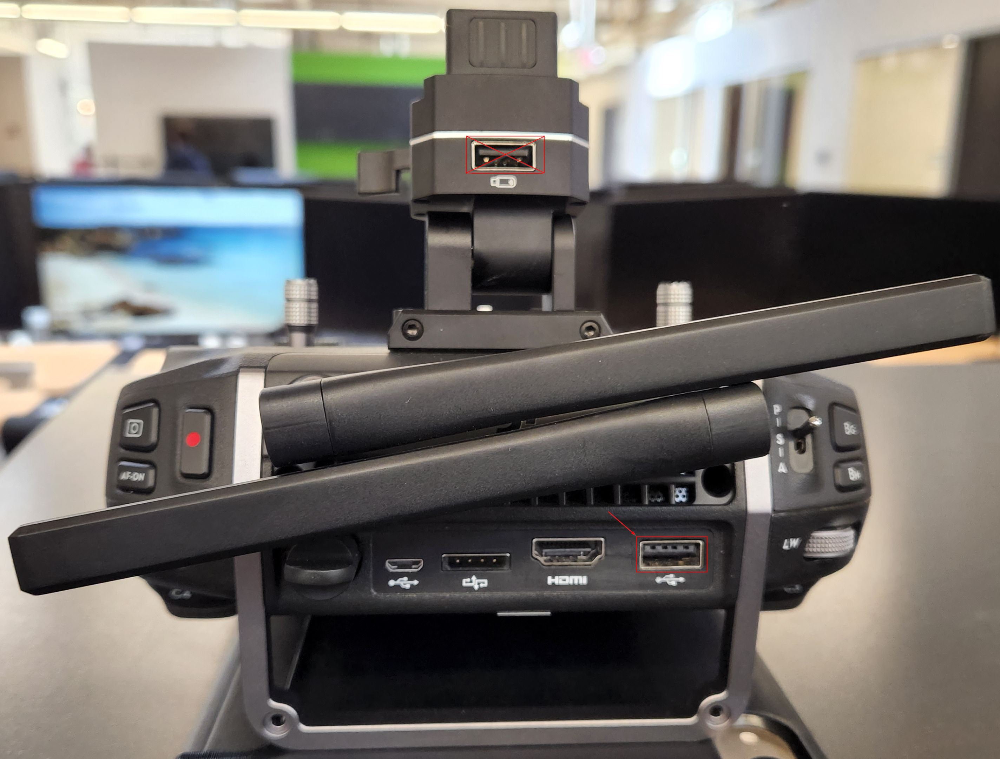

# FAQS - Does M210 V2 with Crystal Sky work on FieldAgent

Does M210 V2 with Crystal Sky work with FA?

Crystal Sky uses Android for its operating system (OS) and therefor would be incompatible with FA Mobile, i.e., FA Mobile only uses iOS and iOS Devices (iPad and iPhone).

Can I get FA to work with Crystal Sky RC controller?

Yes, in order to get this to work you will need to make sure that the crystal sky display is removed from the controller and you will need to purchase either an iPad or iPhone see compatibility in link ( [Apple Devices](https://app.gitbook.com/s/ZgxcabwSCSKC3cebaIwD/requirements/apple-devices "mention") ). In addition, make sure that you are using an apple cord that is USB A to USB-C or Lightning depending on what type of iPad or iPhone port you have on the device. Also, you will want to make sure that you are plugging into the lower right USB port, see image below.

