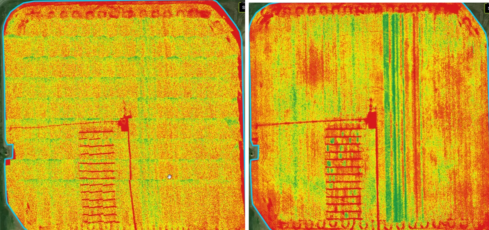

# FAQS - QuickTile vs Stitched Mosaic

## What is the difference between a Stitched Mosaic and a QuickTile? 

Simply, a QuickTile looks like a map comprised of many images and a Mosaic looks like map comprised of a single image. Stitched Mosaics may look cleaner, but are not always worth the extra flight time required to capture the necessary overlap. A video description can be found at the bottom of this article.

<figure><figcaption>
<strong>Quicktile image is on the left and Mosaic Image is on the right</strong>
</figcaption></figure>

### QuickTile 

QuickTiles, although a bit of a rough image, are available to view within minutes after importing; No internet is required for a QuickTile using FieldAgent on Desktop. Images are placed on on a map below the point where they were collected. Images are not compared to adjacent images, as they are in a stitched Mosaic. QuickTiles can still be used to [create Management Zones and Prescriptions](../create-and-export-management-zones-and-prescription-files.md).

**Pros:**

* Automatically generated when the flight is imported into FieldAgent
* Appears in the Map Layer area on FieldAgent
* Images are laid out exactly in order they were taken
* Can be processed at field edge, no internet needed
* Accessed immediately, ground-truthing can be performed immediately
* Images can be exported into a farm management tool

\
**Cons:**

* Images are not as accurately aligned
* QuickTiles may lack the detail of a stitched mosaic. In the example above, it is difficult to make out the plot trial or strip trial lines in the QuickTile, whereas those features very clear and defined in the stitched mosaic.

### Stitched Mosaic 

A mosaic compares each image to all images adjacent to it. This allows for more accurately positioning geographically. Comparison between images also allows for smoothing between images to the point that it is almost impossible to tell the result is composed of sometimes 100s or 1000s of images. Mosaics are available only after post-processing.&#x20;

**Pros:**&#x20;

* Stitched Mosaics produce a MUCH better looking result
* It is easy to see features that span multiple images in a stitched mosaic
* You receive both a QuickTile and a Full Mosaic for a single flight
* Images can be exported into a farm management tool

\
**Cons:**

* Longer post-processing time
* Appears in Map Layer only after processing
* Must order through Sentera, results take several hours to one day later
* Not available at field edge
* Internet is needed&#x20;

