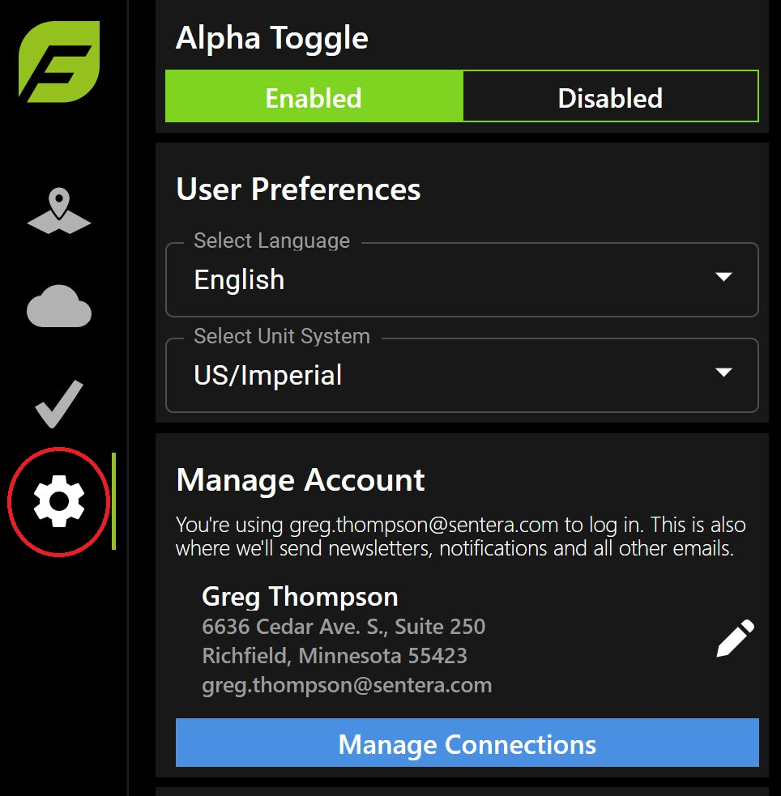

# FieldAgent - Connect with Climate FieldView

### **What data is transferred between Climate and FieldAgent after a connection is made?**

<figure><figcaption></figcaption></figure>

If fields are re-imported into FieldAgent, field names, boundaries and farm names will be updated to those in Climate. The field contents, including any data layer maps, will remain in the field page. The field will not be duplicated.\

### Connecting Personal Fields 

Use this process to connect to Climate FieldView:

1. Log into FieldAgent Web [https://fieldagent.sentera.com/](https://fieldagent.sentera.com/)
2. Click the gear icon in the left-side of the menu.

<figure><figcaption></figcaption></figure>

3. Select Manage Connections.

<figure><figcaption></figcaption></figure>

4. Click Connections.

<figure><figcaption></figcaption></figure>

5. Click Connect to Climate FieldView.&#x20;

<figure><figcaption></figcaption></figure>

6. Enter your Climate View credentials.&#x20;
7. Click Sign In.
8. Click Allow to approve the connection between Sentera and Climate FieldView.&#x20;

<figure><figcaption></figcaption></figure>

9. You are returned to the Cloud dashboard. Note the connection is established.

<figure><figcaption></figcaption></figure>

10. Return to FieldAgent Desktop [https://fieldagent.sentera.com/](https://fieldagent.sentera.com/)
11. Click the + from the upper right hand corner to import field.&#x20;

<figure><figcaption></figcaption></figure>

12. Select Climate FieldView from the Choose a Partner to Import Fields dropdown list.&#x20;

<figure><figcaption></figcaption></figure>

13. Click Select Fields for Import. The available fields will populate.

<figure><figcaption></figcaption></figure>

14. Select the checkboxes next to the fields to import.

<figure><figcaption></figcaption></figure>

15. Click Import Field. A success message displays when complete.

### Renewing Your Connection 

To renew an existing Climate FieldView Connection:

1. Open [FieldAgent.Sentera.com](http://fieldagent.sentera.com/) and login.
2. Click the gear icon  in the left sidebar.
3. Select Management Connections.\
   &#x20;
4. Select Renew Climate FieldView Connection.\
   
5. Login to Climate FieldView and select Allow.\
   

### Connecting Grower Accounts 

Field Boundaries that exist in other applications, such as Climate FieldView, can be easily imported into FieldAgent.

**Connect an External Grower Account to your FieldAgent Account**

To import a grower’s fields into your FieldAgent account:&#x20;

1\. Open FieldAgent Web: [https://fieldagent.sentera.com](https://fieldagent.sentera.com/)

2\. Click on the Grower Management icon in the left-side of the window, as shown in the following figure.&#x20;

> &#x20;\
>

3\. Click Add Grower Organization.&#x20;

<figure><figcaption></figcaption></figure>

4\. Enter a name for the Grower Organization.

<figure><figcaption></figcaption></figure>

5\. Click Send Connection Invite.&#x20;

> &#x20;\
>

6\. Fill out the cells as appropriate:

> a. **External Partner**\
> &#x20;       Currently, only Climate FieldView is supported.
>
> b. **Send To**\
> &#x20;       A connection email can either be sent to you or the grower. If you are with the grower and they can enter their credentials it may be easier to select Send To Me.
>
> c. **First Name**\
> &#x20;       Grower’s First Name
>
> d. **Last Name**\
> &#x20;       Grower’s Last Name
>
> e. **Email Address**\
> &#x20;       Grower’s Email Address&#x20;

<figure><figcaption></figcaption></figure>

7\. Click Add Grower Organization. Depending upon the selection for Send To, either you or the grower will receive an invite in their email to connect their account.

<figure><figcaption></figcaption></figure>

8\. The grower organization will now display in My Growers area, as shown in the following figure.

<figure><figcaption></figcaption></figure>

9\. The connection email looks like the email below. Once the grower clicks the link in the connection email, enters their user name and password, and clicks Allow, all of their fields will be imported into FieldAgent under the organization you created.

<figure><figcaption></figcaption></figure>

10\. Click Map Layers from the left-hand side of the window. You will now see all fields that were imported, as well as all other fields in or under your current organization.

11\. To view only the fields in the newly added organization, select the organization from the Select Organization dropdown menu from the top right-hand side of the window.&#x20;

<figure><figcaption></figcaption></figure>

12\. The new organization fields display in the Fields area.

<figure><figcaption></figcaption></figure>

\
