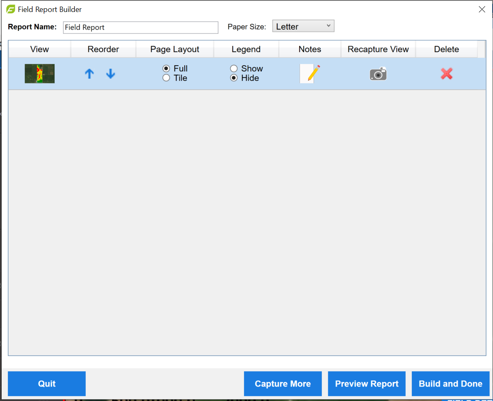
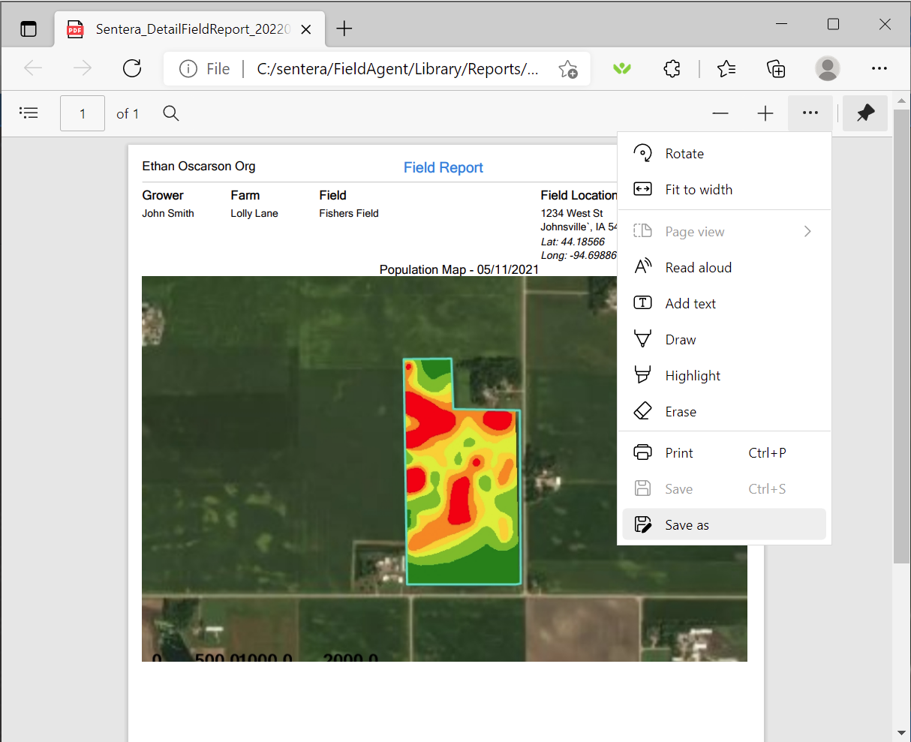

# FieldAgent - Create and Share a Report

## Create a Report in FieldAgent on Desktop 

FieldAgent Desktop has two options for creating reports; Basic and Detailed.

## Basic Report 

To generate a basic report:

1. Open FieldAgent on Desktop.
2. Navigate to the field you would like to generate a report on.
3. Set up the screen with the content you would like to display on the report.
4. Select the PDF icon at the top of the screen.
5. Select basic report.
6. Add notes.
7. Click Done.

<figure><figcaption></figcaption></figure>

## Detailed Report 

To generate a more detailed report, select Detailed Field Report when given the option. With this option selected you’ll be able to use the camera icon at the top of the screen or within a photo viewer to capture the images you’d like to include in the report.

<figure><figcaption></figcaption></figure>

When you’ve captured all the images you’d like to include in the report, select the report icon at the top of the screen.

<figure><figcaption></figcaption></figure>

A tool will open which allows you to customize the report.

<figure><figcaption></figcaption></figure>

Make any changes you’d like and then select Build and Done.

## Sharing a Report

With the .PDF report open on your computer, select Save As.

<figure><figcaption></figcaption></figure>

Name and save the report in a location you can navigate to later. The report can then be shared via any desired communication method (for example, email).

## Create a Web Report 

From the Field menu:

1. Select a field, as shown in the following figure.

<figure><figcaption></figcaption></figure>

2. Select a map layer, as shown in the following figure

<figure><figcaption></figcaption></figure>

3. Select an item from the Map Layer area, as shown in the following figure. Click back arrow to return to Field Details.

<figure><figcaption></figcaption></figure>

4. Click Create Report, as shown in the following figure.

<figure><figcaption></figcaption></figure>

6. Select Paper Size, if appliable.
7. To upload a logo to brand the report, click the Logo toggle switch, as shown in the following figure.

<figure><figcaption></figcaption></figure>

8. Drag and drop a logo graphics file, or click Upload File to browse to the logo location.
9. Rename the logo something familiar to easily identify for future reports.
10. Click Save Logo.
11. Click the Contact Details toggle switch to enter details to display on the report.

<figure><figcaption></figcaption></figure>

12. Enter the contact details.
13. Name the Contact Details Name something familiar to easily identify for future reports.
14. Click Save Contact.
15. The web report displays showing default names. You can rename the report to something more appropriate to this field by clicking the edit button, as shown in the figure below. The image name can be renamed also by clicking the edit button. You can so add notes to the report by clicking the Add Note button.

<figure><figcaption></figcaption></figure>

16. The report is ready to download. Click Download Report to save to your computer.

<figure><figcaption></figcaption></figure>

17. The report can be sent to others through your email application.

## Create Stand Report On The Web 

1. Select a field.
2. Click Map Layers.
3. Select Spot Scout map.

<figure><figcaption></figcaption></figure>

 <mark style="background-color:blue;">If a Spot Scout population map is selected, the report title is changed to Stand Count and planting rate and population is added</mark>

4. Click the back arrow to return to the Field Details menu.
5. Click Create Report. Add logo and contact information, if applicable.
6. The Stand Count Report displays.

<figure><figcaption></figcaption></figure>

 <mark style="background-color:blue;">Note that the Spot Scout Map changes display between FieldAgent Web and the web report. This is to increase the readability of the data. The next section covers why and how FieldAgent Web does this.</mark>

<figure><figcaption></figcaption></figure>

