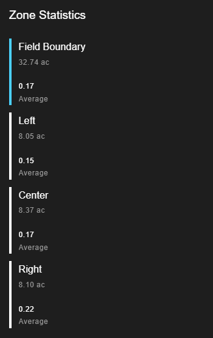

# FieldAgent - Creating Zones and Comparing Areas of a Field

## Comparing Satellite Zones In FieldAgent Web 

Satellite Imagery is useful for monitoring your fields from any location. Use satellite to check-in routinely or as a first response after receiving a FieldAgent Notifications. Satellite images may be able to detect and diagnose the conditions in your field. If you're still curious about what's happening in your field, you can use satellite images to pinpoint areas for drone or ground scouting.

### Quantitative (Number Based) Comparisons

Visual comparisons can work well and may help with most decision making, however values allow you to put numbers to areas and compare without bias.

Let's say we are comparing three seed varieties or three farming practices in three different locations within a field. We can start by looking at an NDVI crop health satellite layer and performing a visual comparison. In the example below, we can see that all three sections of the field seem to be performing relatively well. If we had to say, the middle section appears to be performing the “worst”, although still very green.

<figure><figcaption></figcaption></figure>

Each pixel in an NDVI or NDRE health map contains a health value for that location. We’ll get into more on these values in the next section, but for now, understand that the higher the number, the “healthier” the location is.

To view average values for each location in this field:

1. Add new zones to the field by clicking on the + button in the zones section.

<figure><figcaption></figcaption></figure>

2. Use the toolbar on the right to create a zone
   1. Add Polygons: Select one of the drawing tools    When you are done, select Finish where you selected the drawing tool.
   2. Move Corners: Select the corner edit tool on the right to move corners. When you are done, select Finish where you selected the edit corner tool.
   3. Move Shape: Select the drag layers tool  then click and drag the zone to move its locations. When you are done, select Finish where you selected the drag layers tool.
   4. Delete a Boundary: Select the erase tool  and then any polygons you’d like to delete. When you are done, select Finish where you selected the erase tool.
3. Name the zone, click Finish on the right side of the window to complete your drawing and then click Save.
4. Repeat this for each zone you’d like to compare
5. Then add an NDVI or NDRE map layer to your screen.
6. Click on a layer to view the details of that layer.
7. Scroll to the bottom of the screen on the left and look for the section labeled Zone Statistics. Here you’ll find the average NDVI or NDRE value for each zone you’ve created as well as an average for the full field boundary.

<figure><figcaption></figcaption></figure>

8. Click Download Shapefile under the display mode section.\
   \
   The downloaded file can now be used in a tool such as SMS to create a prescription.



This is useful when comparing zones within a field as shown in the above example, but can also be useful when comparing two fields. Simply compare the Field Boundary Zone Statistics of a Satellite layer on one field to that of another field. This tool can also be useful for evaluating drydown progression. Below are 5 dates with their NDVI map layers, as well as the Field Boundary NDVI value. You can see the progression from a lush field, to one that is dried down and ready for harvest. By comparing the values across fields, or within zones of a single field, you may be able to direct harvest order.

<table data-header-hidden><thead><tr><th valign="top"></th><th valign="top"></th><th valign="top"></th><th valign="top"></th><th valign="top"></th></tr></thead><tbody><tr><td valign="top">
 

August 22nd 
</td><td valign="top">
 

September 6th 
</td><td valign="top">
 

September 16th 
</td><td valign="top">
 

September 21st 
</td><td valign="top">
 

September 26th 
</td></tr><tr><td valign="top">NDVI Value: 0.84 </td><td valign="top">NDVI Value: 0.74 </td><td valign="top">NDVI Value: 0.34 </td><td valign="top">NDVI Value: 0.29 </td><td valign="top">NDVI Value: 0.19 </td></tr></tbody></table>

### Exporting your satellite zone maps&#x20;

to learn more about exporting your zone maps click [HERE](create-and-export-management-zones-and-prescription-files.md)

## Comparing Stand/Tassel of Areas in FieldAgent Web 

1. Ensure each area you'd like to compare has a zone. If necessary create a zone by pressing the + button under the Zones section on a field page. Learn how to create a Zone [HERE](fieldagent-create-edit-and-delete-a-field-boundary.md).
2. Turn on a Stand Count Layer with the discs and numbers.

<figure><figcaption></figcaption></figure>

3. Click on the individual layer to open the layer details.

<figure><figcaption></figcaption></figure>

4. Under the Zone Statistics section, you'll see your list of zones, as well as their Minimum, Maximum, and Average Stand or Tassel Counts.

<figure><figcaption></figcaption></figure>

## Example Stand Count Comparison 

The values of two zones can be compared.\
In this example we are comparing the right and left halves of a field, each planted with a different seed variety.\
By visually altering the colorizations, setting the Bins to 2, we can see that the Right half of the field should have a lower average stand count.\
\
\
Using the zone statistics, we can see the seed variety on the right has an average of \~2k more plants per acre.

<figure><figcaption></figcaption></figure>

<figure><figcaption></figcaption></figure>

### Exporting your Stand/Tassel zone maps  

to learn more about exporting your zone maps click [HERE](create-and-export-management-zones-and-prescription-files.md)

### Comparing NDVI/NDRE of Areas in FieldAgent Desktop 

1. Locate and turn on the NDVI or NDRE survey you'd like to perform a comparison with.\
   \

2. Turn on all shapes you'd like to compare the area of. If you need to create a shape, click Add or learn how to create shapes on FieldAgent Desktop [HERE](https://support.sentera.com/portal/en/kb/articles/fieldagent-drawing-fields#Add_a_Call_Out_Area_in_the_Field_with_a_Shape_File).\
   
3. Open the Toolbox.\
   
4. Select the Avg checkbox in the lower right. The number in the toolbox is the average for the whole field boundary.\
   
5. You'll see the Average NDVI or NDRE values display as part of each selected shape.&#x20;

<figure><figcaption></figcaption></figure>

6. If a report is generated at this point, it will include
   * The map image you selected.
   * The average values for each selected shape displayed on the map.
   * The average value for the whole field boundary.
   * The acreage of each shape.
   * The acreage of each color range in the whole field boundary.
   * Any notes that you add to describe your field.&#x20;

<figure><figcaption></figcaption></figure>

