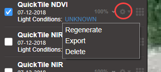
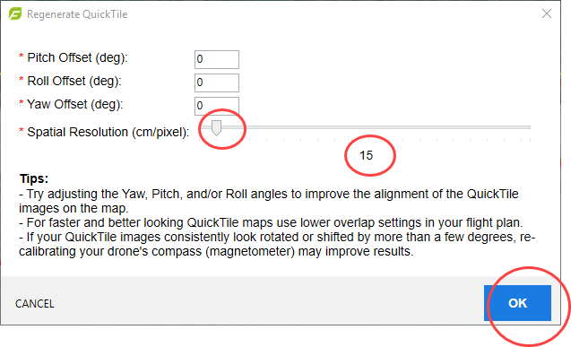
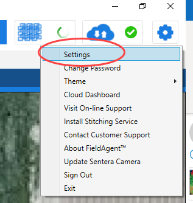
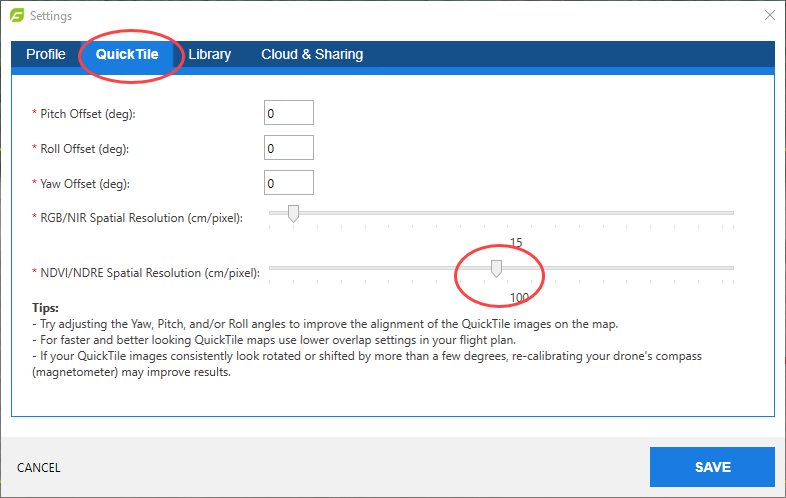
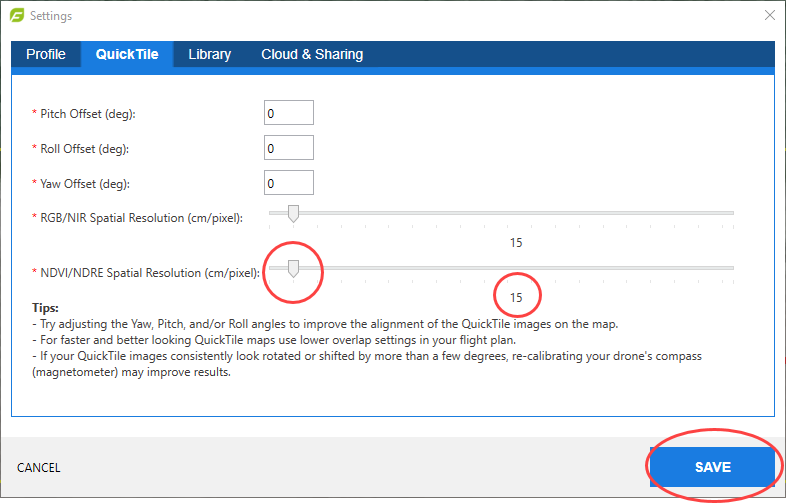

# FieldAgent Desktop - Adjusting the Resolution of your NDVI or NDRE Images

While the QuickTile images in FieldAgentTM are fairly detailed for NDVI or NDRE images, some users prefer to adjust their resolution. You can do this one of two ways.\
\
**To adjust an existing NDVI or NDRE QuickTile:**\
\
1\. From the left-hand menu, select the gear icon next to the image name, and then select Regenerate.

<figure><figcaption></figcaption></figure>

2\. Move the Spatial Resolution slider bar to the left. We do not recommend going any lower than 15.

<figure><figcaption></figcaption></figure>

3\. Click OK.\
4\. FieldAgent will start to regenerate the QuickTile and will display the updated QuickTile when it is done.

\
**To make this a default setting for future imports in FieldAgent:**\
\
 _<mark style="background-color:yellow;">**Note: This will increase the amount of time it takes to generate a QuickTile during import.**</mark>_\
\
1\. Click the gear icon in the top right corner FieldAgent Desktop.\
\
\
\
2\. Select Settings from the dropdown menu.

<figure><figcaption></figcaption></figure>

3\. Select QuickTile from the tab and move the NDVI/NDRE Spatial Resolution slider to the left.

<figure><figcaption></figcaption></figure>

4\. Once the value is achieved click Save.

<figure><figcaption></figcaption></figure>
