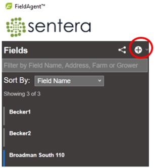
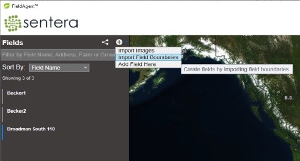
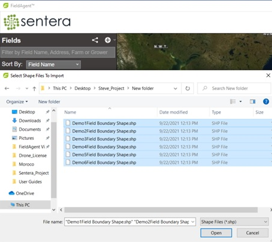
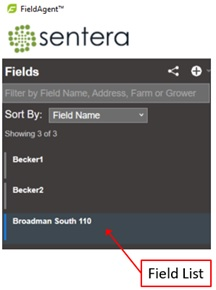

# FieldAgent Desktop - Mass Import of Field Boundaries

To mass import field boundaries into FieldAgent Desktop you need:\
\
**Prerequisites:**

* Shapefile extension format: .shp file format.
* Shapefile format: Geographic Coordinate System: GCS\_WGS\_1984.
* All shapefiles to be imported should be in the same folder location.

**Including Grower and Farm Name?**\
\
FieldAgent Desktop will check to see if the Attributes Table in your shapefile has the following information.\
\
Grower: CLIENT\_NAM, GROWER\_NAM, CustName or grower\
Farm: FARM\_NAME, FarmName, and farm\
\
If these details are included they too will be imported with shapefile.\
\
**To import field boundaries:**

1. Select the plus + button at the top of the field menu.&#x20;

<figure><figcaption></figcaption></figure>

2. Select Import Field Boundaries. A file explorer window displays.

<figure><figcaption></figcaption></figure>

3. Browse to the location of the .shp files, select all to be imported (ctrl A) and click Open to import, as shown in the figure below. The field boundary information displays the location marker view.&#x20;

<figure><figcaption></figcaption></figure>

4. To view field details, select a field from the Fields list. The Field View window displays.

<figure><figcaption></figcaption></figure>

