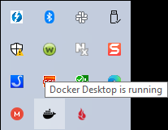
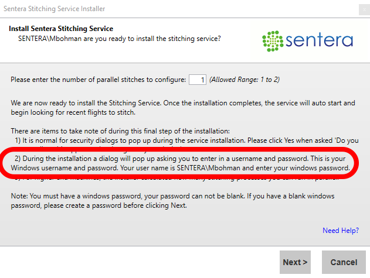

# FieldAgent Desktop - Sentera Stitching Service Install Manual

 <mark style="background-color:yellow;">Note:</mark> <mark style="background-color:yellow;"></mark><mark style="background-color:yellow;">**Installation of the stitching service is optional and not required**</mark><mark style="background-color:yellow;">. If you do not meet the spec requirements, just use the order feature within FA Desktop to order a mosaic</mark> (&#x20;

## Requirements for Installing 

#### PREREQUISITES 

* Microsoft .NET Framework 4.6.1 (x86 and x64)

#### SYSTEM REQUIREMENTS 

* A 64-bit version of Windows 8/10/11 Pro \[[help](https://support.microsoft.com/en-us/kb/827218)]
* <mark style="color:red;">Minimum of 32 GB of RAM</mark>
* <mark style="color:red;">Minimum of a 4 core / 8 thread CPU</mark>
* <mark style="color:red;">Minimum of 25 GB free disk space</mark>
* Virtualization must be enabled on your PC
* FieldAgent Desktop application must be installed on your PC

#### USER WINDOWS ACCOUNT REQUIREMENTS 

* You must have a Windows administrator account on the machine.
* You must have a password on your Windows account.
* You must be able to access installs.sentera.com.
* Sentera Stitching Service Installer must be able to make HTTP requests to api.sentera.com.
* You must be able to store data on a local, non-removable disk.
* You should have the latest .NET and Windows patches applied (not necessary with the exception of version 4.6.1 of the .NET framework).

## Download and Install 

The purpose of this document is to guide a FieldAgent user through the download and installation of the Sentera Stitching Service. If you have any issues, contact Support at Sentera.

### Stitching Service  

1. Navigate to [http://installs.sentera.com/stitching\_service/](http://installs.sentera.com/stitching_service/)
2. Validate that the PC meets the system requirements.
3. Click  at the bottom of the window.&#x20;
4. Open the folder where the file was saved, downloads is typically the default location.

<figure><figcaption></figcaption></figure>

5. Double-click setup.exe to launch the installer.
6. Click Install, as shown in Figure 1.

<figure><figcaption>
<mark style="color:blue;">Figure 1: Click Install</mark>
</figcaption></figure>

7\.       The download dialog box appears with a status bar, as shown in Figure 2.

<figure><figcaption>
<mark style="color:blue;">Figure 2: Download Status Bar</mark>
</figcaption></figure>

8\.       "Install the Sentera Stitching Service" is selected by default, as shown in figure 3. Click next to finish the installation.

<figure><figcaption></figcaption></figure>

## Docker 

The next step detects whether Docker has been installed on your machine. If not, Figure 4 displays.

1. Click "Install Docker". The Docker Desktop Installer.exe file downloads. The file is quite large, and depending on the speed of your internet connection, it may take some time to download.

<figure><figcaption>
<mark style="color:blue;">Figure 4: Detect Docker Installation</mark>
</figcaption></figure>

2. Once the download is complete, double-click Docker Desktop Installer.exe to start the install process.
3. If prompted, select Yes in the User Account Control dialog box, as shown in Figure 5.

<figure><figcaption>
<mark style="color:blue;">Figure 5: User Account Control</mark>
</figcaption></figure>

4. Ensure both checkboxes are selected and click OK, as shown in Figure 6.

<figure><figcaption>
<mark style="color:blue;">Figure 6: Configuration</mark>
</figcaption></figure>

5. Docker for Windows installs. Once complete, an installation success notification displays, as shown in Figure 7.

<figure><figcaption>
<mark style="color:blue;">Figure 7: Installation Success</mark>
</figcaption></figure>

6. Click Close.

 <mark style="background-color:yellow;">Note: Make sure that any work is saved before continuing with the next steps.</mark>

7. Click on search in the lower center of the screen (when using windows 11) and type in Docker, select Docker as shown in Figure 8. It will take a few minutes to launch.

<figure><figcaption>
<mark style="color:blue;">Figure 8: Windows Docker</mark>
</figcaption></figure>

8. If the WSL 2 Kernel is not installed or up-to-date, Docker will prompt to install the update. Select the link in the dialog box, as shown in Figure 9.

<figure><figcaption>
<mark style="color:blue;">Figure 9: Click URL Link</mark>
</figcaption></figure>

9. The webpage will load on Step 4. Click the link for WSL2 Linux kernel update package for x64 machines, as shown in Figure 10.

<figure><figcaption>
<mark style="color:blue;">Figure 10: Click WSL2 Link</mark>
</figcaption></figure>

10. Run the installer for the downloaded wsl\_update\_x64.exe file.
11. When prompted, click Next, as shown in Figure 11.

<figure><figcaption>
<mark style="color:blue;">Figure 11: Click Next</mark>
</figcaption></figure>

12. If prompted, click Yes in the User Account Control dialog box, as shown in Figure 12.

<figure><figcaption>
<mark style="color:blue;">Figure 12: Click Yes</mark>
</figcaption></figure>

13. Once the install of the wsl\_update\_x64.exe is complete, click Finish, as shown in Figure 13.

<figure><figcaption>
<mark style="color:blue;">Figure 13: Click Finish</mark>
</figcaption></figure>

14. Open Docker and click on the settings icon

<figure><figcaption>
<mark style="color:blue;">Figure 14: Settings Icon</mark>
</figcaption></figure>

15\.  Change the settings to match what is shown in figure 15, i.e., check " Start Docker Desktop when you sign in to your computer" and "Use the WSL 2 Based engine" and click button "Apply & restart".

<figure><figcaption>
<mark style="color:blue;">Figure 15: Docker Settings Menu</mark>
</figcaption></figure>

16. Wait until Docker restarts and displays the message “Docker Desktop is running,” which will display in the hidden Icons menu on the windows task bar.

<figure><figcaption>
<mark style="color:blue;">Figure 16: Hidden Icon Menu</mark>
</figcaption></figure>

## Configure the Stitching Service 

1. Return to the Sentera Stitching Service Installer, and click "Validate Docker Installation".

<figure><figcaption></figcaption></figure>

2. A success message will pop up if you have installed docker and checked the correct settings.

<figure><figcaption></figcaption></figure>

3. Click Next in the Sentera Stitching Service Installer.
4. Select the number of parallel stitches to configure, a larger number allows for faster processing. Then click Next.

<figure><figcaption></figcaption></figure>

5. Enter your Windows username and password in the popup

<figure><figcaption></figcaption></figure>

Refer to the Sentera Stitching Service Installer if you're having trouble logging in.

<figure><figcaption></figcaption></figure>

6. Click Yes to continue.

<figure><figcaption></figcaption></figure>

7. The Installation Success Message will now display. If the installation was not successful, follow the instructions to remedy the installation. Click Close.

<figure><figcaption></figcaption></figure>

8. Restart your computer.&#x20;
9. After the successful installation of the Sentera Stitching Service, launch FieldAgent. An icon displays at the top right of the screen, which shows the status of any stitching job

<figure><figcaption></figcaption></figure>

 <mark style="background-color:yellow;">Note: At the first launch of FieldAgent, after installation, the Sentera Stitching Service will attempt to stitch all fields. Automatic stitching takes place in the background every time you import a new survey. Once a field has been stitched, no notifications that it is complete displays. The newly stitched full mosaic will be automatically available in the FieldAgent Field View for the imported field and survey.</mark>

## Manually Select a Field to Stitch 

To manually select field to stitch:

1. Navigate to the Field View screen for the field you want to stitch.
2. Select the survey date and then click the Stitching Icon to add the survey to the stitching queue.

<figure><figcaption></figcaption></figure>

3. The Stitching Service validates that it can process the images, then will let you know when the field is in the Stitching queue.

<figure><figcaption></figcaption></figure>

4. The survey chosen to stitch displays in the stitching queue. View the queue by clicking on the stitching Icon on the top right of the screen.

## Troubleshoot 

From time to time, the Stitching Service does not work as expected. The following are some simple troubleshooting steps to get things back on track.

1. Try a simple Restart of the PC, as shown in Figure 29.

 <mark style="background-color:yellow;">Note: Make sure it is a Restart and not a Shutdown or Sleep of the PC. It really does matter.</mark>

<figure><figcaption>
<mark style="color:blue;">Figure 29: Restart</mark>
</figcaption></figure>

2. Once the computer has restarted, log into Windows. Wait until Docker reports that it is running before logging into FieldAgent.
3. If this doesn't solve the problem, then shut down Docker by selecting it from the hidden icons area, as shown in Figure 30.

<figure><figcaption>
<mark style="color:blue;">Figure 30: Hidden Icons Area</mark>
</figcaption></figure>

4. Right-click on the Docker icon and select Quit Docker, as shown in Figure 31.

<figure><figcaption>
<mark style="color:blue;">Figure 31: Quit Docker</mark>
</figcaption></figure>

5. Click the Search icon in the bottom left center of the taskbar and type Services into the search box and select Services from the Best Match item list, as shown in Figure 32.

<figure><figcaption>
<mark style="color:blue;">Figure 32: Services</mark>
</figcaption></figure>

5. Navigate to Sentera Stitching Service, right-click to select Stop, as shown in Figure 33.

<figure><figcaption>
<mark style="color:blue;">Figure 33: Stop</mark>
</figcaption></figure>

7. Restart the computer.
8. Log in and then wait for the Docker to run.
9. Launch FieldAgent.
10. Repeat Step 6 to navigate the Services to determine if Sentera Stitching Services is running. If not, then right-click, and select Start.

## Update Passwords 

To change the password for Sentera Stitching Service:

1\. Click the Search icon in the bottom left center of the taskbar (windows 11), as shown in Figure 34.

<figure><figcaption>
<mark style="color:blue;">Figure 34: Search Icon</mark>
</figcaption></figure>

2\. Click the Search icon in the bottom left center of the taskbar and type Services into the search box and select Services from the Best Match item list, as shown in Figure 35.

<figure><figcaption>
<mark style="color:blue;">Figure 35: Services</mark>
</figcaption></figure>

3\. Navigate to Sentera Stitching Service, as shown in Figure 36.

<figure><figcaption>
<mark style="color:blue;">Figure 36: Sentera Stitching Service</mark>
</figcaption></figure>

4. Right-click on Sentera Stitching Service and select Properties, as shown in Figure 37.

<figure><figcaption>
<mark style="color:blue;">Figure 37: Properties</mark>
</figcaption></figure>

5. Type the new Windows password in both the Password and Confirm Password fields, as shown in Figure 38.

<figure><figcaption>
<mark style="color:blue;">Figure 38: Password</mark>
</figcaption></figure>

6. Click OK to change your password.
