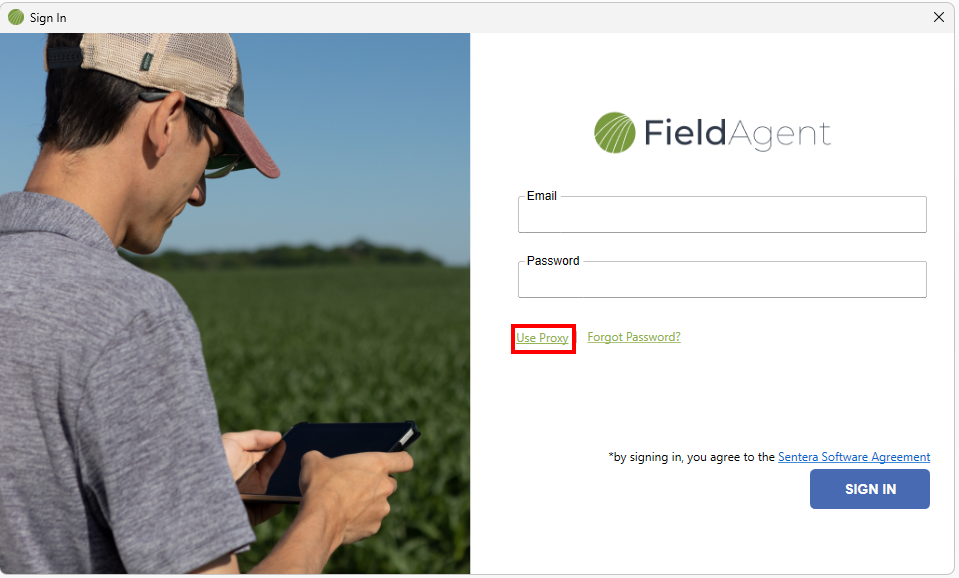

# FieldAgent Desktop User Guide

Introduction\
 
-----------------------------------------------

Welcome to the Sentera FieldAgent™ User Guide. This user guide is designed to provide documentation for people who will use FieldAgent on a professional basis. This document is designed to be read by any user of FieldAgent, as most users will have access to the features documented here. This guide is targeted to new users with an understanding of digital agricultural platforms.

FieldAgent Product Overview\
 
-----------------------------------------------------------------------------

The Sentera  FieldAgent helps advisors, agronomists, and producers gather in-season, whole-farm insights to maximize yield and profitability. It integrates data from drones, satellites, soil, and field operations with powerful models and AI tools that give ag professionals the knowledge they need to manage the best outcome .\
FieldAgent includes synchronized mobile, web, and desktop applications and API integration with many leading digital agricultural platforms. These integrations enable easy sharing and workflow integration of FieldAgent images, analytics, and insights. Imagery, index products like NDVI and NDRE, and advanced tools like stand and population count, weed detection, and tassel mapping are all available within FieldAgent.

## Install FieldAgent 

To install FieldAgent:

1. Install FieldAgent from the Sentera Support site\
   if you haven’t done so, at  [https://installsprod.sentera.com/fieldagent/](https://installsprod.sentera.com/fieldagent/) If you need assistance downloading FieldAgent, contact [support@sentera.com ](mailto:support@sentera.com)for the link. The FieldAgent icon displays in the Start Menu under Sentera applications when the download is complete.
2.  Select one of two options for quick access to FieldAgent:

    1. Click the Start menu on your desktop to place the icon on the Start menu, or click Start on the taskbar.
    2. Find Sentera in your applications list, expand and  right-click on the FieldAgent icon to Pin to Start, as shown in the following figure. If FieldAgent is open, then right-click on the icon on the Taskbar to Pin to Taskbar.

    
<figure><figcaption>
<mark style="color:blue;">Figure: Start Menu</mark>
</figcaption></figure>

    c. Select Pin to Start. The FieldAgent icon displays in the Start menu.

3\. Click and hold the FieldAgent icon and drag to the taskbar and release. The FieldAgent icon appears on the taskbar.\

## Create an Account 

In order to have an account you need to have a subscription. In order to purchase a subscription, see link ([https://sentera.com/agronomic-analytics/](https://sentera.com/agronomic-analytics/)). At the bottom of the page you can order. If you already have a subscription see instructions below.

1. Click the FieldAgent icon from the Start menu or taskbar.
2. Click Create an Account.
3. Enter your email address and password.
4. Click OK.

## Sign In 

To sign in to FieldAgent:

1. Click the FieldAgent icon from the Start menu or taskbar.
2. Enter your Email and Password, as shown in the following figure.

<figure><figcaption>
<mark style="color:blue;">Figure: Sign In</mark>
</figcaption></figure>

### Add a Proxy Server 

Some corporate environments require applications to access data through a proxy server to prevent unauthorized access to the network. Once FieldAgent is installed, set up the proxy server.

1. Click Use Proxy on the FieldAgent Sign In window. The Proxy Setup window displays, as shown in the following figure.

<figure><figcaption>
<mark style="color:blue;">Figure: Sign In</mark>
</figcaption></figure>

2. Select Manual proxy configuration, as shown in the following figure.

<figure><figcaption>
<mark style="color:blue;">Figure: Proxy Setup</mark>
</figcaption></figure>

3. Type in the Web Server/Proxy Server address and Port Number given to you by the Sentera Support. Click Save. The Sign In window displays.
4. Enter your Email and Password.
5. Click Sign In, as shown in the following figure.

<figure><figcaption>
<mark style="color:blue;">Figure: Sign In</mark>
</figcaption></figure>

### Remove a Proxy Server 

When you are not on the corporate network, you do not need to use the proxy server to allow FieldAgent to connect to the internet. The proxy server connection can be turned off.

1. Click "Use Proxy" on the FieldAgent Sign In window. The Proxy Setup window displays, as in the following figure.

<figure><figcaption>
<mark style="color:blue;">Figure: Sign In</mark>
</figcaption></figure>

2. Select No proxy, then click Save, as shown in the following figure.

<figure><figcaption>
<mark style="color:blue;">Figure: Proxy Setup</mark>
</figcaption></figure>

3. Enter your Email and Password, as shown in the following figure.

<figure><figcaption>
<mark style="color:blue;">Figure: Sign In</mark>
</figcaption></figure>

4. Click Sign In.

 <mark style="background-color:yellow;">Note:  The first login will take a few minutes to several hours as FieldAgent builds data in the background, depending upon how much data is being retrieved.</mark>

5. The FieldAgent home page displays a satellite map. Once data is loaded into FieldAgent, map points display that indicate where a field is located on the map, as shown in the following figure.&#x20;

<figure><figcaption>
<mark style="color:blue;">Figure: Map</mark>
</figcaption></figure>

## Navigate the Map

The following section describes how to navigate the map window.

### Map Functions 

Features on the map window make it quick and easy to navigate FieldAgent, as shown in the following figure.

<figure><figcaption>
<mark style="color:blue;">Figure: Map</mark>
</figcaption></figure>

* Organization:  Dropdown list of your organization’s fields or fields that were shared with you.
* Map Point : Displays survey field locations imported into FieldAgent. Multiple locations display multiple waypoints. The map points work as a hyperlink to the field. Click the Map Point to access the field

The map points are color-coded to indicate the status of the field.\
&#x20;  Indicates the field has images associated with it.\
&#x20;  Indicates the field has no images associated with it.\
&#x20;  Indicates the field was shared with users.

* Fields : Searches for fields by name, address, farm, or grower.
* Sort By : Filters out data by specific field name, grower, or farm.
* Create Surveys : Imports images from the drone. See Import Field Data for more information.
* Local Stitching Service Status : If installed, this icon displays the status of any activity within the service.
* Sync Status : Displays if data is synched to cloud storage, or, if syncing is not active, it displays the last successful sync, as well as the next scheduled sync date and time.
* Settings : Displays the options to change settings, reset password, contact support, update Sentera camera, and logout of FieldAgent.
* Zoom : Zoom in or zoom out on the map. This can also be accomplished by using the scroll wheel on the mouse, left and right mouse buttons, and with the track pad on a laptop.
* Street View/Satellite : Toggles between a street view map or a satellite view map.

### Add Basic Field Details 

Fields can be added directly onto the map window without the need to import images. This allows the user to create fields and sync some basic information before they fly the field.

### Add Field 

To add a field:

1. Zoom in on the map to the field location.
2. Right-click on the field. One option appears, as shown in the following figure.

<figure><figcaption>
<mark style="color:blue;">Figure: Add Field</mark>
</figcaption></figure>

**Add Field:**\
Create a new field and set a generic field boundary , as shown in the following figure. The boundary can be edited later. When adding a field, enter at minimum, the name of the field, and then click Save.

\
 <mark style="background-color:yellow;">Note:  When naming a field, follow your organization’s naming convention, or use an attribute you can associate with the field, such as farmer, field name, area, or a combination of items. Examples include: JohnSmith\_Corn or FarmerCoop\_Towerville\_Wheat.</mark>

<figure><figcaption>
<mark style="color:blue;">Figure: Add Field details</mark>
</figcaption></figure>

\
 <mark style="background-color:yellow;">Note:  You can also Add a Field by selecting the plus + button at the top of the field menu.</mark>

### Import Field Boundaries 

To import field boundaries:

1. Select the plus + button at the top of the field menu, as shown in the following figure.

<figure><figcaption>
<mark style="color:blue;">Figure: Import Field Boundaries</mark>
</figcaption></figure>

2. Select Import Field Boundaries. A file explorer window displays.
3. Browse to the location of the .shp file, select\
   it, and click Open to import, as shown in the following figure. The field boundary information displays the location marker view.

<figure><figcaption>
<mark style="color:blue;">Figure: Import Field Boundaries</mark>
</figcaption></figure>

### Field View 

The following sections review the view, add, and edit the field.\

## Navigate Multi Level Org Fields 

You can view fields in your organization(s) assigned to you or that you have access to. Some fields have multiple levels or hierarchy. There are two ways to search for the field you want to view. The following section describes those options.

### Use Menu Hierarchy 

To search using the hierarchy menu to view all of the fields under a particular organization:

1. Select the dropdown menu from the upper right corner of the screen, next to your organization name to expand the organization’s field list, as shown in the following figure.

<figure><figcaption>
<mark style="color:blue;">Figure: Fields</mark>
</figcaption></figure>

2. Continue to select arrows until the correct field is found.
3. Select the field.

### Search

To search using the Search field:

1. Enter the name, address, farm, or grower of the field, as shown in the following figure

<figure><figcaption>
<mark style="color:blue;">Figure: Fields</mark>
</figcaption></figure>

2. As you start to type the name of the field, it starts to auto-populate the list, as shown in the following figure. Or you can select the field from the list of fields.

<figure><figcaption>
<mark style="color:blue;">Figure: Auto-populated Fields</mark>
</figcaption></figure>

3. Select a field.

## Field View Navigation 

To navigate the Field View window:

1. From the Fields list, double-click the field. The field data displays, as show in the following figure.

<figure><figcaption>
<mark style="color:blue;">Figure: Field View</mark>
</figcaption></figure>

2. Select the Field Details box in the lower right corner of the screen to edit, delete, or share the field, as shown in the following figure.

<figure><figcaption>
<mark style="color:blue;">Figure Field Details</mark>
</figcaption></figure>

**Edit**:  Allows the user to change the name, address, city, state/province, ZIP/postal code, grower, or farm, as shown in the following figure.

\
 <mark style="background-color:yellow;">Note:  This field is useful as surveys are imported and listed by imported date rather than a name that would be more relevant.</mark>

<figure><figcaption>
<mark style="color:blue;">Figure: Edit Field</mark>
</figcaption></figure>

**Delete**: Allows the user to delete all data for the selected field and remove it from the local drive and the cloud storage. Click Yes to complete this action or No to cancel, as shown in the following figure.

<figure><figcaption>
<mark style="color:blue;">Figure: Delete Field</mark>
</figcaption></figure>

**Share**: Allows the user to share the survey with FieldAgent Pro users. You can share with multiple users by separating the email addresses with a semicolon (;), as shown in the following figure.

<figure><figcaption>
<mark style="color:blue;">Figure: Share Site - Cell Site</mark>
</figcaption></figure>

### Mass Import Field Boundaries 

To mass import field boundaries into FieldAgent Desktop, you need:

\
**Prerequisites:**

* Shape file extension format: .shp file format.
* All shape files to be imported should be in same folder location.
* Shape file format: Geographic Coordinate System: GCS\_WGS\_1984.  Note:  If an error message is received, check to make sure your format matches this.

Use QGIS to check the Properties, as shown in the following figure.

<figure><figcaption>
<mark style="color:blue;">Figure: CRS Properties</mark>
</figcaption></figure>

To import field boundaries:

1. Select the plus + button at the top of the field menu, as shown in the following figure.

<figure><figcaption>
<mark style="color:blue;">Figure: Add Fields</mark>
</figcaption></figure>

2. Select Import Field Boundaries. A file explorer window displays, as shown in the following figure.

<figure><figcaption>
<mark style="color:blue;">Figure: Import Field Boundaries</mark>
</figcaption></figure>

3. Browse to the location of the .shp files, select all to be imported (Ctrl + A) and click Open to import, as shown in  the following figure . The field boundary information displays the location marker view.

<figure><figcaption>
<mark style="color:blue;">Figure: Select Shape Files to Import</mark>
</figcaption></figure>

4. If import data information does not match, FieldAgent will request a field name. Use something similar to FIELD\_Name, Field\_Name, FieldName, fieldname, or so forth, as it pertains to your data set.
5. To view field details, select a field from the Fields list. The Field View window displays, as shown in the following figure.

<figure><figcaption>
<mark style="color:blue;">Figure: Fields List</mark>
</figcaption></figure>

## Settings 

To change the various settings:

1. Click the gear icon at the top corner of the window.
2. Select Settings.
3. Select the corresponding tab.

### Profile Tab 

The Profile tab allows the user to update user information. To update the profile information:

1. Select the Profile tab.
2. Update the the name, phone number, ZIP/postal code, and email address, as shown in the following figure.

\
 <mark style="background-color:red;">Warning : Changing the email address will change the user’s login ID.</mark>

<figure><figcaption>
<mark style="color:blue;">Figure: Profile Tab</mark>
</figcaption></figure>

3. Click Save to save the changes.

### QuickTile Tab 

The Quicktile tab allows the user to adjust the pitch and yaw.

1. Select the QuickTile tab to set these features, as shown in the following figure.

<figure><figcaption>
<mark style="color:blue;">Figure: QuickTile Tab</mark>
</figcaption></figure>

To understand how pitch, roll, and yaw affects the aircraft, see the following figure.

<figure><figcaption>
<mark style="color:blue;">Figure: Pitch, Roll, Yaw</mark>
</figcaption></figure>

Pitch adjusts the tilt of the image from left to right or right to left. Keep in mind that FieldAgent displays the top of the image faces east.\
Roll adjusts the tilt of the image from top to bottom.\
Yaw adjusts the image from left to right on a flat plane.

2. Slide the Spatial Resolution (cm/pixel) to adjust the number of  centimeters  per pixel in the QuickTile image. The higher the number, the lower the resolution.
3. Click Save.

### Library Tab 

The Library tab allows the user to change the location of the Sentera library (database), as well as the amount of space allocated for the library on the user’s personal computer.

1. Click Change to browse to the new location of the library, as shown in the following figure.

\
 <mark style="background-color:yellow;">Note:  The new location should be a drive that is installed on the personal computer and not a removable drive or network drive.</mark>

<figure><figcaption>
<mark style="color:blue;">Figure: Library Tab</mark>
</figcaption></figure>

2. The Current library size is the total size of the library on your PC. Enter the new Disk space. This field allows for FieldAgent to dynamically grow as the database continues to grow. This amount should always be larger than the current library.
3. Check the Turn on cloud mirroring field to provide that option.
4. Select the appropriate radio button to download the images to be stored locally.
5. Enter Grower or Farm information to narrow the downloaded data to be based on one or both criteria.

### Cloud Tab 

The Cloud tab allows the user to manage the sync status of fields.

1. Select the Turn on Cloud mirroring checkbox to download an exact replica of the content in the Cloud, as shown in the following figure.

<figure><figcaption>
<mark style="color:blue;">Figure: Cloud tab</mark>
</figcaption></figure>

2. Several options display, giving the user control over what data is downloaded, as shown in the following figure.

<figure><figcaption>
<mark style="color:blue;">Figure: Cloud Mirroring Options</mark>
</figcaption></figure>

 <mark style="background-color:yellow;">Note:  The options allow the download of all imagery and photo dot locations, or less data downloads by selecting only the items you have created or only items at a specific location.</mark>

3. Click Save.

### Sharing Tab 

The Sharing tab allows the user to manage the sync status and sharing of fields.

1. Select the Show only shared fields to display only those fields that are shared with another FieldAgent user, as shown in the following figure.

<figure><figcaption>
<mark style="color:blue;">Figure: Sharing tab</mark>
</figcaption></figure>

2. Enter the field name in the Search field to limit the number of results for a specific field. The field list displays all fields, their sync status, share options, and with whom it is shared.
3. Click Share to enter an email of a FieldAgent Viewer or Pro User email address to share a field. When a field is shared, it displays the email address in the Shared With field.
4. Click Revoke in Options column to revoke shared permission with the user.
5. Click Save.

## Import Field Data 

The following section describes how to import field data.

### Import Data Sets 

To import data sets:

\
 <mark style="background-color:red;">Warning:  Do not insert or remove the micro SD card when the camera is turned on.</mark>

1. Turn off the drone and camera and remove the micro SD card, if equipped.
2. Insert the micro SD Card into your personal computer.
3. Click Create Surveys to start the import process. The New Survey(s) dialog box displays, as shown in the following figure.

<figure><figcaption>
<mark style="color:blue;">Figure: New Survey(s)</mark>
</figcaption></figure>

 <mark style="background-color:yellow;">Note : The user can decide on import whether to stitch imagery by selecting Auto stitch on import. For example, if a QuickTile was flown, the user could disable stitching. Decision is on a per-survey basis, so all sensors are stitched or no sensors are stitched. Double 4K RGB is never stitched, so a user with a Double 4K analytic who wants an NDVI Mosaic should enable stitching. FieldAgent will run stitching on the NDVI, but not the RGB.</mark>

4. Click on browse to search in file explorer or drag and drop the folder(s) that the images are stored.
5. Browse to the location of the images to import and select it, as shown in the following figure.

<figure><figcaption>
<mark style="color:blue;">Figure: Select Folder(s)</mark>
</figcaption></figure>

 <mark style="background-color:yellow;">Note : The user can decide on import whether to stitch imagery by selecting</mark>\ <mark style="background-color:yellow;">Auto Stitch on Import.</mark>\ <mark style="background-color:yellow;">For example, if a QuickTile was flown, the user could disable stitching. Decision is on a per-survey basis, so all sensors are stitched or no sensors are stitched. Double 4K RGB is never stitched, so a user with a Double 4K analytic who wants an NDVI Mosaic should enable stitching. FieldAgent will run stitching on the NDVI, but not the RGB.</mark>

6. Click Select Folder to start the import process. The progress bar will show the status of your import.
   1. &#x20;After the progress bar is done, If the field does not exist to which the images are being imported, it will auto draw a border around the images. you can modify this by clicking on the arrow icon  to the right of the number of images and then clicking on edit under the boundary map, see image below.

<figure><figcaption>
<mark style="color:blue;">Modifying the Field Boundary of a New Field Upon Import</mark>
</figcaption></figure>

&#x20;   b. In addition, you can move around the points by clicking and dragging, once you are done, click on the done button, see image below. Also, you can modify the field name if the field name does not exist by clicking on the arrow icon as well. and then modifying the field name.

<figure><figcaption></figcaption></figure>

 <mark style="background-color:yellow;">Note: In order to save and create the import, you will need to give the field name a name.</mark>

\
 <mark style="background-color:yellow;">Note:  When the folder is selected to import, the file explorer window will display No items match your search. This is normal.</mark>

7. If there are additional items to import from another micro SD card, swap out the card and repeat steps 5 to 6.

\
 <mark style="background-color:yellow;">Note:  This step is essential if your flight had multiple battery swaps or not all of the folders containing images were selected the first time.</mark>

8. If appropriate, uncheck Remove images of horizon? or Enable flat field correction? to turn off these functions. For most users, these boxes remain checked. In order to uncheck these items click on the 3 dots to the right of the text "select surveys you would like to include in your import", see image below.

<figure><figcaption>
<mark style="color:blue;">Image Import Settings</mark>
</figcaption></figure>

 <mark style="background-color:yellow;">Note: Remove images of horizon, allows images that have too much sky displaying to properly process and may prevent FieldAgent from QuickTiling the image. Enable flat field correction clears up some carry-over data from image to image of out of range values.</mark>\

9. Click Create Import once complete. The Image & Boundary Confirmation window displays.

\
 <mark style="background-color:yellow;">Note: Once imagery is imported to a field that is not in your home organization, but you want to see analytics for a field you have access to, share the field to yourself. As a result, you will be able to see the Mosaics, tassel counts, and other analytics you ordered, as well as the ability to produce PDF reports.</mark>

10. When the import is successful, a list of fields display, as shown in the following figure.

<figure><figcaption>
<mark style="color:blue;">Figure: Image Import Successful</mark>
</figcaption></figure>

11. Click Analytics. The Analytics Button in order to get the Analytics options display, as shown in the following figure.

<figure><figcaption></figcaption></figure>

11. Select the analytics that you want.
12. Click Submit.
13. Click Yes to acknowledge the Analytic. Your Analytic is now placed and will be processed.

## Image & Boundary Confirmation 

Now that you have imported images in the previous section, the Image & Boundary Confirmation window allows you to view thumbnails and make changes, as shown in the following figure.

<figure><figcaption>
<mark style="color:blue;">Figure: Image &#x26; Boundary Confirmation</mark>
</figcaption></figure>

1. To view a thumbnail image of what photo corresponds to the photo dot, mouse over the photo dot, as shown in the following figure.

<figure><figcaption>
<mark style="color:blue;">Figure: Photo dot view</mark>
</figcaption></figure>

2. If there are no changes, click Next.
3. If changes are needed, mouse over the New Survey box in the lower left corner to select which item to edit. The Survey Tools dialog box displays, as shown in the following figure.

<figure><figcaption>
<mark style="color:blue;">Figure: Survey Tools</mark>
</figcaption></figure>

4. Select the survey tool needed:

\
**Image Selection:**  Changes the size and shape of the field boundary. Click a corner or boundary line and drag it to its new position. This can be repeated for any of the other corners or boundary lines, as shown in the following figure. Click Save.

<figure><figcaption>
<mark style="color:blue;">Figure: Bounda</mark>r<mark style="color:blue;">y</mark>
</figcaption></figure>

**Split Survey:**  Breaks the image into two separate fields. Click a boundary line or corner and create the shape of the new fields. Alternatively, there is a crosshair in the center of the image when Split Field is selected. The user can move a field boundary and perform edits to the size and shape, as shown in the following figure.

<figure><figcaption>
<mark style="color:blue;">Figure: Split Field</mark>
</figcaption></figure>

5. Click Save once complete.

\
**Edit Details:**  Appears automatically for any new survey, as shown in Figure 44. Also, can be edited during the import process.

<figure><figcaption>
<mark style="color:blue;">Figure: Edit Boundary</mark>
</figcaption></figure>

6. Enter the Name in the Edit Field dialog box, as shown in the following figure. Every field requires a unique name.

<figure><figcaption>
<mark style="color:blue;">Figure: Edit Field</mark>
</figcaption></figure>

**Remove from Selection:**  Removes the selected survey from the import process only. If you are only importing one survey, this will cancel the import process.

7. Click the photo dot to import it into FieldAgent, as shown in the following figure. Individual images (dots) can be turned on and off by clicking on it to indicate it will be imported (red = no, green = yes).

<figure><figcaption>
<mark style="color:blue;">Figure: Red Dots to be Imported</mark>
</figcaption></figure>

8. Click Next to complete the import process. If the field has not yet been named, it will prompt the user before the import can be completed. The New Survey(s) confirmation dialog box displays. Click Open Field to immediately navigate to the field, as shown in the following figure.

<figure><figcaption>
<mark style="color:blue;">Figure: New Survey(s)</mark>
</figcaption></figure>

9. Click Done to close. The imported images are now listed in the Field View window under Surveys, and the QuickTile are listed under Image Layers, as shown in the following figure.

<figure><figcaption>
<mark style="color:blue;">Figure: Surveys</mark>
</figcaption></figure>

## Field View 

The following sections review the view, add, and edit the field.

### Field View Navigation 

To navigate the Field View window:

1. From the Fields list, double-click the field. The field data displays, as shown in the following figure.

<figure><figcaption>
<mark style="color:blue;">Figure: Field View</mark>
</figcaption></figure>

The Field View window contains the following views:

* **Field Boundary:** Turns the boundary view of the field on and off, and the number of acres contained within the boundary.
* **Surveys:** Views of imported surveys associated with the field. There may be multiple surveys listed for one field.
* **Photo Dots:** Views where the photos were taken as represented by a dot.
* **QuickTile RGB:** Turns on and off the RGB imagery displayed in Field View.
* **QuickTile NDVI:** Turns on and off the NDVI imagery displayed in Field View.
* **QuickTile NIR:** Turns on and off the NIR imagery displayed in Field View.
* **QuickTile VARI:**  Turns on and off the VARI imergy displayed in Field View.
* **Full Mosaic RGB:** Turns on and off the RGB imagery displayed in Field View.
* **Full Mosaic NDVI:** Turns on and off the NDVI imagery displayed in Field View.
* **Full Mosaic NIR:** Turns on and off the NIR imagery displayed in Field View.
* **Elevation Map:** Views imported elevation maps and contour lines.
* **Street Map:** Views street names.
* **Satellite:** Turns on and off the National Agriculture Imagery Program (NAIP) data. When turned off, the view is displayed white.
* **Field Details:** Views the synced status, name of the field, acres, latitude, longitude, and address information. The user can also share the field with other  users by email.
* **Field View and Document View Tabs:** Toggles the view of the data.

### Field Tools 

Sentera FieldAgent provides tools to pan and zoom within the field, as well as measure the distance of a field from one point to another, as well as measure the area of a field, as shown in the following figure.

<figure><figcaption>
<mark style="color:blue;">Figure: Field Tools</mark>
</figcaption></figure>

**Hand Tool**

The hand tool is used to pan the field. Click on the hand and then click on the field to drag the field into line of vision.\

**Zoom Tool**

Click the Zoom icon and then double-click the left mouse button on the field to zoom in and double-click on the right mouse button to zoom out of the field.\

**Measure Tool**

To measure the distance in a line, for example, from the north end of a field to the south end of a field:

1. Navigate to the FieldView screen to display a field or area to measure.
2. Select the Line Measure icon from the right-hand side of the window, as shown in the following figure.

<figure><figcaption>
<mark style="color:blue;">Figure: Measure Tool</mark>
</figcaption></figure>

3. Click on the first point on the map or area, for example, the north end of the field.
4. Click on the second point on the map or area, for example, the south end of the field.
5. Continue for more points on the map.
6. View the measurement of that distance that displays.
7. Move the line tool to adjust the measurement, if necessary.
8. Double-click for the final measurement and to exit the Line Measure icon.

To measure an area or field in feet:

1. Navigate to the FieldView screen to display a field or area to measure.
2. Select the Area Measure icon from the right-hand side of the window.
3. Click on the first point on the map or area, and then continue adding points until the area is complete.
4. View the measurement of that area that displays.
5. Move the line tool to adjust the measurement, if necessary.
6. Double-click for the final measurement and to exit the Area Measure icon.
7. To return to the normal mouse function, click on the Hand icon on the right-hand side.

## Field Boundaries 

The following section describes how to view, edit, add, and delete field boundaries.

### View Field Boundaries 

The following section describes how to view the field boundaries.

1. Select Field Boundary from the Shapes menu.
2. Select various checkboxes from the Shapes menu to toggle between the various views of the shapes and the boundaries. The yellow and blue boundaries, or your color of choice at setup, correspond with the options under the Shapes menu, as shown in the following figure.

<figure><figcaption>
<mark style="color:blue;">Figure: Field Boundary view</mark>
</figcaption></figure>

<figure><figcaption>
<mark style="color:blue;">Figure: Field Boundary view unselect</mark>
</figcaption></figure>

### Edit Field Boundaries 

The following section describes how to edit the field boundaries.

1. Click the gear icon to edit the shape.
2. Select Edit Shape, as shown in the following figure.

<figure><figcaption>
<mark style="color:blue;">Figure: Edit Shape view</mark>
</figcaption></figure>

3. Select the type of shape to create from the Draw dropdown menu, and click Draw. The navigational tools become active, as shown in the following figure.

<figure><figcaption>
<mark style="color:blue;">Figure: Draw dropdown menu</mark>
</figcaption></figure>

&#x20;     a. Click     to drag the shape to any location, as shown in the following figure.

<figure><figcaption>
<mark style="color:blue;">Figure: Polygon Tool view</mark>
</figcaption></figure>

&#x20;   b. Click    to change the size of the shape without affecting the shape, as shown in the following figure.

<figure><figcaption>
<mark style="color:blue;">Figure: Rectangle Tool view</mark>
</figcaption></figure>

&#x20;   c. Click    to rotate the shape, as shown in the following figure.

<figure><figcaption>
<mark style="color:blue;">Figure: Circle Tool view</mark>
</figcaption></figure>

&#x20;   d. Click any line and drag it to a new position.

4. Click Save to complete and update the changes.
5. Sync with the cloud before closing FieldAgent to ensure that all files are updated. Alternately, click Cancel to delete all changes.

### Add Field Boundaries 

The following section describes how to add a field boundary:

1. Click Add in the Shape menu to create a new shape to a field, as shown in the following figure. There is no limit to the layout of the shape.

<figure><figcaption>
<mark style="color:blue;">Figure: Add Shape Tool</mark>
</figcaption></figure>

2. Select the type of shape to create from the Draw dropdown menu, and click Draw, as shown in the following figure. There can be multiple shapes for the field boundary.

<figure><figcaption>
<mark style="color:blue;">Figure: Add Multiple Shape to a Field</mark>
</figcaption></figure>

3. Double-click if polygon, or if other shapes, click Save in the Shape Editing Help popup when it is complete, as shown in the following figure. The Add Shape window displays.

<figure><figcaption>
<mark style="color:blue;">Figure: Shape Editing Help</mark>
</figcaption></figure>

4\. Name the shape and select a color, as shown in the following figure.

<figure><figcaption>
<mark style="color:blue;">Figure: Name the Shape</mark>
</figcaption></figure>

5. Click OK to save the shape.

### Delete Field Boundaries 

The following section describes how to delete a field boundary:

\
 <mark style="background-color:yellow;">Note:  The delete function is only available on shape files that are not listed as a field boundary.</mark>

1. Click the gear icon next to the shape and select Delete from the menu, as shown in the following figure.

<figure><figcaption>
<mark style="color:blue;">Figure: Delete the Field Boundary</mark>
</figcaption></figure>

2. Click OK to confirm the deletion, as shown in the following figure.

<figure><figcaption>
<mark style="color:blue;">Figure: Delete Shape Confirmation</mark>
</figcaption></figure>

## Shapes 

This section describes the Shapes menu.

### Import a Shape or Boundary 

To import a shape or boundary:

1. Within the field view Shapes area, select Import, as shown in the following figure.

<figure><figcaption>
<mark style="color:blue;">Figure: Import</mark>
</figcaption></figure>

 <mark style="background-color:yellow;">Note:  You can also import more than one shape or field boundary at a time.</mark>

2. Select a .shp file, as shown in the following figure.

<figure><figcaption>
<mark style="color:blue;">Figure: Select Shape File</mark>
</figcaption></figure>

3. View the shape file displayed in the field view and Shapes area, as shown in the following figure.

<figure><figcaption>
<mark style="color:blue;">Figure: Shape Displays</mark>
</figcaption></figure>

### Remove a Shape 

To remove a shape:

1. Select the shape in the Shapes area to be deleted.
2. From the gear icon, select Edit Shape, as shown in the following figure.

<figure><figcaption>
<mark style="color:blue;">Figure: Edit Shape</mark>
</figcaption></figure>

3. Click Remove, as shown in the following figure.

<figure><figcaption>
<mark style="color:blue;">Figure: Remove</mark>
</figcaption></figure>

4. Move the cursor to the shape to be removed, as shown in the following figure.

<figure><figcaption>
<mark style="color:blue;">Figure: Red X cursor</mark>
</figcaption></figure>

5. Click the shape. The shape is removed.
6. Return to the Shapes area, select the gear icon next to the shape, select Delete, as shown in the following figure. The shape is removed from the Shapes area.

<figure><figcaption>
<mark style="color:blue;">Figure: Delete</mark>
</figcaption></figure>

### Export a Shape or Field Boundary 

Exporting boundary or shape files can be performed in two ways:

1. Select the shape or boundary, click the gear icon next to the item, and select Export, as shown in the following figure. The Export  Shape dialog box displays.

<figure><figcaption>
<mark style="color:blue;">Figure: Export the Shape</mark>
</figcaption></figure>

 <mark style="background-color:yellow;">Note:  This will export the boundary or shape only. If there are other shapes for field boundaries, they need to be exported individually.</mark>

2. Select the Export To dropdown menu, as shown in the following figure.

<figure><figcaption>
<mark style="color:blue;">Figure: Export Field Boundary Shape</mark>
</figcaption></figure>

3. Select the location to export to:

#### **Export File or Case IH**

\
If File or Case IH is selected, a folder containing the data is created on your personal computer.

A. Click ellipsis if exporting to File or Case IH to select the location of the export shape file, as shown in the following figure.

<figure><figcaption>
<mark style="color:blue;">Figure: Ellipsis</mark>
</figcaption></figure>

B. Select the location on the Export Shape Filename dialog box and click Save, as shown in the following figure.

<figure><figcaption>
<mark style="color:blue;">Figure: Export Shape Filename</mark>
</figcaption></figure>

C. Click Export. The File or Case IH is exported.

#### Export John Deere Files

If John Deere is selected, files are sent to a connected MyJohnDeere account. See the [_MyJohnDeere User Guide_ ](fieldagent-myjohndeere-connection-user-guide.md)for more information. If John Deere is selected, a folder containing the data is created on your personal computer.

1. Click ellipsis if exporting to John Deere  to select the location of the export shape file .
2. Select the location on the Export Shape Filename dialog box and click Save, as shown in the following figure.

<figure><figcaption>
<mark style="color:blue;">Figure: Export Shape Filename</mark>
</figcaption></figure>

3. Click Export.  The John Deere file is exported .
4. Click Close to confirm, as shown in the following figure.

<figure><figcaption>
<mark style="color:blue;">Figure: Success</mark>
</figcaption></figure>

 <mark style="background-color:yellow;">Note:  The user will need to import these files to the respective tools.</mark>

### Create Multiple Shapes 

1. Click the gear icon next the shape and select Edit Shape to add additional shapes to an existing field boundary, as shown in the following figure.

<figure><figcaption>
<mark style="color:blue;">Figure: Edit Shape menu</mark>
</figcaption></figure>

2. Select the shape from the dropdown menu and manipulate using the tools, or just start to draw the new shape, as shown in the following figure.

<figure><figcaption>
<mark style="color:blue;">Figure: Select a Shape Menu</mark>
</figcaption></figure>

3. Draw shapes on the field boundary, as shown in the following figure.

<figure><figcaption>
<mark style="color:blue;">Figure: Draw Shapes</mark>
</figcaption></figure>

4. Click Save in the Shape Editing Help dialog box when done drawing, as shown in the following figure. The updated field boundary displays the increased number of acres accordingly.

<figure><figcaption>
<mark style="color:blue;">Figure: Shape Editing Help</mark>
</figcaption></figure>

## Surveys 

Surveys are a collection of flights or images for a field. The surveys are sorted and listed by date. The date is based on the date the images were taken.

### Select a Survey 

To select a survey:

1. Click the check box next to the survey to display corresponding data, as shown in the following figure.

<figure><figcaption>
<mark style="color:blue;">Figure: Surveys View</mark>
</figcaption></figure>

2. Click the gear icon next to the survey to add note, delete, export, regenerate QuickTiles, and order Mosaics or analytics of the field, and re-sync to the Cloud, as shown in the following figure. You can also click on one of the symbols near the gear icon to quick-select these options.&#x20;

<figure><figcaption>
<mark style="color:blue;">Figure: Surveys options</mark>
</figcaption></figure>

### Add Notes 

To add notes to a survey:

\
 <mark style="background-color:yellow;">Note:  Notes added at import display in the Edit Survey Notes dialog box.</mark>

1. Select Notes to document specifics related to the survey, as shown in the following figure. The Edit Survey Notes dialog box displays. These notes are not visible outside of FieldAgent.

<figure><figcaption>
<mark style="color:blue;">Figure: Edit Survey Notes</mark>
</figcaption></figure>

2. Enter the note data and click Save.
3. Select Notes, highlight information no longer needed, and click Save to delete the unwanted information.

### Delete Survey 

To delete a survey:

1. Select Delete   to remove the entire survey and all associated images and data with it. The Confirmation dialog box displays.

\
 <mark style="background-color:yellow;">Note:  Once the data is deleted it must be reimported if needed again.</mark>

2. Click Yes to confirm the deletion of data, as shown in the following figure.

<figure><figcaption>
<mark style="color:blue;">Figure: Confirmation</mark>
</figcaption></figure>

### Export a Survey 

To export a survey:

1. Select Export to export the entire survey, including all images out of FieldAgent into a folder or external drive. The Export Survey dialog box displays.
2. If necessary, check Export for Pix4D to prep the data for use with Pix4D to make a Mosaic or 3D image, as shown in the following figure. The .csv file is created to ensure there is metadata for Pix4D to use.

<figure><figcaption>
<mark style="color:blue;">Figure: Export Survey</mark>
</figcaption></figure>

3. Browse to the export location, as shown in the following figure.

<figure><figcaption>
<mark style="color:blue;">Figure: Browse for Folder</mark>
</figcaption></figure>

4. Click OK. The Export Survey dialog box displays.
5. Select the File Structure to determine how the folders will be structured, as shown in the following figure:\
   \
   Single Folder places all images in a single folder with a tag folder.\
   Folder per Tag places the folder at the location for the export.

<figure><figcaption>
<mark style="color:blue;">Figure: File Structure</mark>
</figcaption></figure>

6. Click OK to start the export.
7. Click Close to exit.

### Regenerate QuickTiles 

Regeneration of QuickTiles can be performed at the Survey level and at the Image Layer. See  _Regenerate QuickTiles_ section for Image Layer instructions.&#x20;

To regenerate QuickTiles from the Survey layer:

1. Select the gear icon next to the survey.
2. Select Regenerate QuickTiles, as shown in the following figure.

<figure><figcaption>
<mark style="color:blue;">Figure: Regenerate QuickTiles of Survey</mark>
</figcaption></figure>

 <mark style="background-color:yellow;">Note: The QuickTiles of the survey are regenerated using the settings from the gear icon located in the top right corner of the FieldAgent screen, as shown in the following figure.</mark>

<figure><figcaption>
<mark style="color:blue;">Figure: QuickTile Tab</mark>
</figcaption></figure>

### Order Mosaic 

To order the Mosaic:

1. Select Order Mosaic to have the images from the survey turned into a fully stitched image. The Order Mosaic dialog box displays, as shown in the following figure.

<figure><figcaption>
<mark style="color:blue;">Figure: Order Mosaic</mark>
</figcaption></figure>

2. Select which images (Mosaics Requested) to build.
3. Enter any other desired information.
4. Click OK to submit the order.

## Image  Layers 

Image Layers contain the Photo Dots, Tassel, Spot Scout Tassel/Population/Weeds, QuickTiles, Mosaics, Elevation Map, Street Map, and Satellite data associated with each selected survey. The number of images displayed on the map will differ based on the images imported by the survey and the number of surveys selected, as shown in the following figure.

<figure><figcaption>
<mark style="color:blue;">Figure: Image Layers</mark>
</figcaption></figure>

Image layers include:

* Photo Dots:  Indicates where photos were taken.
* QuickTile RGB, QuickTile NIR, and QuickTile NDVI:  Collection of the individual images to create the tiled images, as shown in the following figure.

<figure><figcaption></figcaption></figure>

<figure><figcaption>
<mark style="color:blue;">Figure: QuickTiles Collections</mark>
</figcaption></figure>

* **Light Conditions:** Displays the status of Unknown, Uneven, or Uniform for users with the Incident Light Sensor attached.
* **Full Mosaic:**  Displays high-resolution image of tiles without visual effects imported from a stitching tool.
* **Spot Scout Tassel:**  Tassel count for corn per area, including color indicators where tassel counts vary compared to adjacent counts. Green indicates good counts, red indicates poor counts.
* **Spot Scout Weeds:** **Weed counts for crops, including color indicators where weed counts vary compared to adjacent counts.** Green indicates smaller counts, red indicates larger counts.
* **Spot Scout Population:**  Population count for crops, including color indicators where population or emergence vary compared to adjacent counts. Green indicates good counts, red indicates poor counts.
* **Tassel:**  Broad colored map indicating varying tassel counts, as compared to adjacent counts. Green indicates good counts, red indicates poor counts.
* **Elevation Map:**  Topography, including the shape and character of the Earth's surface.
* **Population Map:**  Broad colored map indicating the varying population counts, as compraed to adjacent counts. Green indicates good counts, red indicates poor counts. The user can control the display by adjusting the Management Zones sliders, as well as selecting equal area or equal spacing.
* **Street Map:**  Displays the street and rivers on the map .
* **Satellite:**  Includes various levels of image quality, based on location, and if connected to the internet or not.

### Photo Dots 

To display photo dots:

1. Click an individual photo dot, as shown in the following figure. The images display associated information with that photo dot.

<figure><figcaption>
<mark style="color:blue;">Figure: Photo Dots</mark>
</figcaption></figure>

2. Click the right or left arrow to scroll through the images. The image will display in the orientation it was taken, as shown in the following figure. This orientation can be adjusted by clicking the N icon on the right side of the image. This allows for the images to display in native orientation or with the top of the image facing north.

<figure><figcaption>
<mark style="color:blue;">Figure: Photo Facing North</mark>
</figcaption></figure>

The following figure displays the RGB (aerial), NIR, and NDVI images associated with photo dot.

<figure><figcaption>
<mark style="color:blue;">Figure: RGB, NIR and NDVI buttons</mark>
</figcaption></figure>

3. Click RGB, NIR, or NDVI buttons to view those images. The associate view displays, as shown in the following figure. Click the circled toggle button to hide the detailed photo information to view more of the photo.

<figure><figcaption>
<mark style="color:blue;">Figure: NDVI view</mark>
</figcaption></figure>

The Menu buttons, as shown in the following figure, allow for a variety of functions:

<figure><figcaption>
<mark style="color:blue;">Figure: Menu Buttons</mark>
</figcaption></figure>

* Share image by email. Includes Annotations.
* Download image to your personal computer .
* Delete image from survey.
* View annotation count.

#### **Add Annotations**

To add annotations, perform the following actions:

1. Right click on the image to add an annotation, as shown in the following figure.

<figure><figcaption>
<mark style="color:blue;">Figure: Add Annotation</mark>
</figcaption></figure>

2. Select the importance and then enter any details, as shown in the following figure.

<figure><figcaption>
<mark style="color:blue;">Figure: Annotations</mark>
</figcaption></figure>

3. Click OK.

#### **Filter Annotations**

Once a photo has had an annotation, it can be difficult to find that photo quickly when you need it again. To filter photos that have no annotation, perform the following steps:

1. Select the Filter icon next to Photo Dots section, as shown in the following figure.

<figure><figcaption>
<mark style="color:blue;">Figure: Filter Icon</mark>
</figcaption></figure>

 <mark style="background-color:yellow;">Note:  FieldAgent displays only the photo dots that have images associated with annotations.</mark>

The following figure displays the Filtered Photo Dots on the map.

<figure><figcaption>
<mark style="color:blue;">Figure: Filtered Photo Dots with Annotations</mark>
</figcaption></figure>

### Opacity Adjustment 

Each QuickTile and Mosaic has the ability to change the opacity of the image on the map in order to see one layer through another.

1. Click  next to the QuickTile from the Image Layers section. The following figure displays the slidebar.

<figure><figcaption>
<mark style="color:blue;">Figure: Slide bar</mark>
</figcaption></figure>

2. Slide the bar to the desired percent.
3. Click anywhere on the menu to start the process. The following figure displays the background map updates.

<figure><figcaption>
<mark style="color:blue;">Figure: Updated QuickTile view</mark>
</figcaption></figure>

#### Move Image Layers 

To move and reorder image layers:

1. Click on the 9-dot square icon   and drag it to reorder the image layers, as shown in the following figure.

<figure><figcaption>
<mark style="color:blue;">Figure: Move Icon</mark>
</figcaption></figure>

2. Repeat this step until all of the image layers are in the order you wish to view them.

### Function Gear 

To regenerate, export, or delete the QuickTile:

1. Click the gear icon next to QuickTile. The following figure  displays the menu to regenerate , export, delete, or edit the name of the QuickTile.

<figure><figcaption>
<mark style="color:blue;">Figure: Regenerate, Export and Delete QuickTile options</mark>
</figcaption></figure>

#### **Regenerate QuickTiles**

To perform a regenerate of QuickTiles:

1. Select Regenerate, which works similar to _Regenerate QuickTiles_ for Survey, with the only difference being it is for the selected QuickTile versus all of the QuickTiles.
2. Adjust the pitch, roll, and yaw offset, as shown in the following figure.

<figure><figcaption>
<mark style="color:blue;">Figure: Regenerate QuickTiles</mark>
</figcaption></figure>

&#x20;To understand how pitch, roll, and yaw affects the aircraft, see the following figure.

<figure><figcaption>
<mark style="color:blue;">Figure: Pitch, Roll and Yaw</mark>
</figcaption></figure>

Pitch adjusts the tilt of the image from left to right or right to left. Keep in mind that FieldAgent displays the top of the image facing east.

Roll adjusts the tilt of the image from top to bottom.

Yaw adjusts the image from left to right on a flat plane.

3. Slide the Spatial Resolution (cm/pixel) to adjust the number of centimeters per pixel in the QuickTile image. The higher the number, the lower the resolution.
4. Click OK to start the processing of the images.

#### **Export QuickTiles**

To export a QuickTile file:

1. Select Export. The Export QuickTile dialog box displays.
2. Select File from the Export To dropdown menu, as shown in the following figure.

<figure><figcaption>
<mark style="color:blue;">Figure: Export Quicktile</mark>
</figcaption></figure>

3. Click the ellipsis button to browse to the export drive or folder on your personal computer or to a connected MyJohnDeere account, as shown in the following figure.

<figure><figcaption>
<mark style="color:blue;">Figure: Browse for Folder</mark>
</figcaption></figure>

4. Select the folder of drive and click OK.
5. Click OK, then click Close.\
   To export a John Deere QuickTile file:
   1. Select John Deere in the Export To dropdown menu. A Notes area displays, as shown in the following figure.

<figure><figcaption>
<mark style="color:blue;">Figure: Select John Deere</mark>
</figcaption></figure>

&#x20;    b. Type in any notes to be included with the export, as shown in the following figure.

<figure><figcaption>
<mark style="color:blue;">Figure: Notes area</mark>
</figcaption></figure>

&#x20;   c. Click OK to export the file.

&#x20;   d. Click Close in the Export QuickTile Results dialog box.

#### **Delete the QuickTiles**

To remove the QuickTiles files from the survey without deleting the entire survey:

1. Click Delete. The Confirm Delete dialog box displays.
2. Click Yes to delete the files.

## Field Details Menu 

To view the status of the sync for this field:

1. Click Field Details in the lower right corner of the menu. This menu displays the status of the sync, name, acres, latitude, longitude, and address for this field, as shown in the following figure.

<figure><figcaption>
<mark style="color:blue;">Figure: Field Details</mark>
</figcaption></figure>

2. Click Edit. The Edit Field dialog box appears, as shown in the following figure.

<figure><figcaption>
<mark style="color:blue;">Figure: Edit Field</mark>
</figcaption></figure>

3. Edit the necessary fields. MyJohnDeere users can link to external fields.
4. Click Share to share the field with other FieldAgent Pro users. The Share Field dialog window displays.
5. Enter an email address. More can be added separated by a comma or semicolon.
6. Click Share.

## NDVI/NDRE Toolbox 

The NDVI/NDRE Toolbox is located at the top left of the Field View window.

1. Select QuickTile NDVI or Full Mosaic NDVI from the Image Layers, as shown in the following figure.

<figure><figcaption></figcaption></figure>

<figure><figcaption>
<mark style="color:blue;">Figure: Full Mosaic NDVI and QuickTile NDVI</mark>
</figcaption></figure>

2. Click the NDVI Toolbox. The NDVI Toolbox expanded window displays, as shown in the following figure.

<figure><figcaption>
<mark style="color:blue;">Figure: NDVI/NDRE Toolbox</mark>
</figcaption></figure>

### NDVI Histogram Chart 

FieldAgent takes the survey data provided by the camera and computes a graph of all the reflectance values. This graph is a histogram, where the X axis is the NDVI value ranging from -1 to 1, and where the Y axis represents acreage. Just by mouse hovering over the graph, the general status of a field can be determined  when the low, high, and acres popup  displays, as shown in the following figure. The healthiest fields have graphs weighted to the right, where less healthy fields are weighted towards the center or left.

<figure><figcaption>
<mark style="color:blue;">Figure: Field Status</mark>
</figcaption></figure>

### Endpoint Adjustment 

FieldAgent allows users to tailor the visible range of the NDVI data through two endpoint sliders below the graph. Users may set the range desired for color mapping by adjusting the position of the sliders. Only the data inside the range of this slider is color mapped. Data outside the range is colored black and omitted from the set. This is useful for studying fields that might border roads, or fields that have crops at different maturity levels. For example, roads generally have NDVI values of less than -.7. By adjusting the left slider to -.6, the roads are omitted from the color map, which is now distributed from -.6 to 1.

#### **Endpoint Slider**

Click and drag the endpoint slider to add or omit various items from the field.

1. Drag either end, or both ends,  to omit items such as roads, ponds, treelines or grass , as shown in the following figure.

<figure><figcaption>
<mark style="color:blue;">Figure: Endpoint Slider</mark>
</figcaption></figure>

The following figure displays the graph before adjusting.

<figure><figcaption>
<mark style="color:blue;">Figure: Before Endpoint Adjustment</mark>
</figcaption></figure>

The following figure displays the graph after adjusting.

<figure><figcaption>
<mark style="color:blue;">Figure: After Endpoint Adjustment</mark>
</figcaption></figure>

### Color Map 

FieldAgent offers four different colored maps that can be applied to NDVI data, as shown in Figure 120. Sometimes, the human eye can perceive differences in blues that may not be readily apparent in greens and reds. Experiment with different settings to see what works best for your eye.

\
 <mark style="background-color:yellow;">Note:  The color map adjusts how the data is colored; it does not change the calculations or statistics of the data. Unless you change it back to Red to Green, it remains the color selected.</mark>

<figure><figcaption>
<mark style="color:blue;">Figure: Color Map</mark>
</figcaption></figure>

#### **Change the Map Color**

To change the map colors:

1. Select the color on the Color Map. The Color Map changes based on the color selected.\
   The following figure displays the graph before selection.

<figure><figcaption>
<mark style="color:blue;">Figure: Before Color Map Selection</mark>
</figcaption></figure>

The following figure displays the graph after selection.

### Bins 

When VARI Map is selected from Image Layers, the graph shown in VARI Toolbox is a histogram. The following figure displays the VARI Toolbox screen.

<figure><figcaption>
<mark style="color:blue;">Figure: VARI Toolbox</mark>
</figcaption></figure>

A histogram is simply a plot of how often a value appears within a bin range. FieldAgent allows you to increase, or decrease, the number of bins used to calculate your histogram and color map. A higher number of bins provides greater contrast in the data, whereas a lower number provides a more coarse, but sometimes, a more useable view.

\
 <mark style="background-color:yellow;">Note:  The bins adjust how the data is colored; it does not change the calculations or statistics of the data. Unless you change bins back to five, it will remain as selected.</mark>

#### **How to Change the Bins**

To change the bins:

1. Click + to increase the number of bins displayed.
2. Click - to decrease the number of bins displayed.\
   The following figure displays the chart before adjustment.

<figure><figcaption>
<mark style="color:blue;">Figure: Before Bin Adjustment</mark>
</figcaption></figure>

The following figure displays the chart after adjustment.

<figure><figcaption>
<mark style="color:blue;">Figure: After Bin Adjustment</mark>
</figcaption></figure>

### View Index

If you capture images with a 6X or a Double 4K multispectral sensor, then you have the option to view a variety of index images. To view a variety of index:

1. Select the Index dropdown at the top of the NDVI Toolbox, as shown in the following figure.

<figure><figcaption>
<mark style="color:blue;">Figure: NDVI Toolbox Index</mark>
</figcaption></figure>

 <mark style="background-color:yellow;">Note:  Your selections may vary, depending upon the options available during the image capture.</mark>

2. Select an Index. Options include:
   1. NDVI (Normalized Difference Vegetation Index)
   2. NDRE (Normalized Difference Red Edge Index)
   3. GNDVI (Green Normalized Difference Vegetation Index)
   4. CIRE (Red Edge Chlorophyll Index)
   5. CIG (Chlorophyll Index - Green)
   6. NDWI (Normalized Difference Water Index)
   7. TCARI/OSAVI (Transformed Chlorophyll Absorption Ratio Index/Optimized Soil Adjusted Vegetation Index)
   8. GLI (Green Leaf Index)
3. View how the image on the map changes, depending upon the index chosen.

### Shape Files 

FieldAgent supports displaying a statistical index value based on shapes. To add shapes to the survey:

1. Click Import from the top of the menu, as shown in the following figure. The Select a Shape File to Open window displays.

<figure><figcaption>
<mark style="color:blue;">Figure: Import</mark>
</figcaption></figure>

2. Browse to the shape file location and click Open, as shown in the following figure. The shape file is imported.

<figure><figcaption>
<mark style="color:blue;">Figure: Browse to Shape File</mark>
</figcaption></figure>

## Zone Management 

The zone management function is part of the NDVI Toolbox and provides the end user the ability to build out Management Zones using either the NDVI QuickTile or NDVI Full Mosaic. In this tool, the user can set the number of management zones, export the GeoTIFF of the map (georeferencing information is embedded), and even start to build out a basic prescription that can be exported.

### How to Use Zone Management 

To use Management Zones:

1. Select NDVI QuickTile or NDVI Mosaic from within the Image Layers section.
2. Click the NDVI Toolbox in the top left corner of the map. The tools in the Management Zones area allow for the adjustment, creation, export of the zones, and create a simple prescription, as shown in the following figure.

<figure><figcaption>
<mark style="color:blue;">Figure: Zone Adjustment</mark>
</figcaption></figure>

3. Click the Zone Details sliding scale to adjust  the level of detail to be included in the zone map. This level can be rough and draw just the major areas, or be very high detailed to highlight the smaller areas. The process can be run many times until the user finds a level of detail they are comfortable with. See the following figure for examples of the possible level of details.

<figure><figcaption></figcaption></figure>

<figure><figcaption></figcaption></figure>

<figure><figcaption>
<mark style="color:blue;">Figure: Lowest Level, Medium Level and Highest Level</mark>
</figcaption></figure>

4. Click the Gap Adjustment sliding scale to adjust the level of the gap between the zones. Sliding it to the left will decrease the gap by increasing the zone size, as shown in the following figure.

<figure><figcaption>
<mark style="color:blue;">Figure: Lowest Level of Gap Adjustment</mark>
</figcaption></figure>

5. Click the gear icon to start the process of generating the zone map, as shown in the following figure. This can be performed at the field edge with either the QuickTile or Mosaic.

<figure><figcaption>
<mark style="color:blue;">Figure: Gear icon</mark>
</figcaption></figure>

6. Click Export to export shape files (polygons) to the desktop, MyJohnDeere, or Case IH, as shown in the following figure. To export MyJohnDeere, the user needs to have linked their MyJohnDeere account to FieldAgent.

<figure><figcaption>
<mark style="color:blue;">Figure: Export Management Zone Shapes</mark>
</figcaption></figure>

7. Click ellipsis to export to a specific folder location, if the files will not be exported to MyJohnDeere.
8. Click Prescription. The Simple Prescription Generator dialog box displays. This tool allows the user to produce a prescription by seeing a value for each zone. The number of zones are determined by the level of detail produced for the Zone Map.
   1. Select the rate desired from the Select Recommended Units dropdown menu, as shown in the following figure.

<figure><figcaption>
<mark style="color:blue;">Figure: Select Recommended Units</mark>
</figcaption></figure>

&#x20;       b. Enter the desired values into the Recommend column, as shown in the following figure.

<figure><figcaption>
<mark style="color:blue;">Figure: Recommend column</mark>
</figcaption></figure>

&#x20;       c. Click OK.\
&#x20;       d. Click Export, as shown in the following figure, to start the export process

<figure><figcaption>
<mark style="color:blue;">Figure: Export Prescription Shapes</mark>
</figcaption></figure>

## Shortcut Toolbar 

The shortcut toolbar displays at the top of the Field View window. Six to seven buttons display, depending on whether or not the local stitching service is installed, as shown in the following figure.

<figure><figcaption>
<mark style="color:blue;">Figure: Shortcut Toolbar</mark>
</figcaption></figure>

The shortcut toolbar may contain these buttons:

.png>) Allows the user, when the local stitching service is installed, to select a survey to stitch. For additional detail on how the button works, see the Sentera Stitching Service Install Manual .

.png>) Starts the process to order analytical data from the survey. For instruction on how to produce and view analytic data, see Run and View Analytics of this manual.

.png>) Allows the user to order a Mosaic of the survey, and if needed, an elevation map, including a 5-band multi-spectral Mosaic. For more information, see Order Mosaics of this manual.

.png>) Allows the user to order custom processing, for those who have setup custom data processing and analytics with Sentera. For assistance or more information, contact Sentera Support.

.png>) Allows the user to share through email what they see on their screen with another person. See Figure 165 in this manual for more information.

.png>) Allows the user to create a data report in PDF format. See Run Reports for more information. Users can choose to print on letter or A4 size.

.png>) Allows the user to share the field and all of its data with another FieldAgent Pro and Viewer user through an email address. See Share a Field for more information.

### Elevation Maps and Contour Lines 

The ability to produce an Elevation Map along with contour lines provides the user with the ability to see high and low spots in the field. From here, the user can share the images and shape files with others or view it to see the high and low spots in the field to determine if drain tile is needed, or if there is a need to change the layout of the field.\

#### **Order Elevation Maps and Contour Lines**

Once the field is fully synced with the cloud servers, you can order an elevation map the same way you would order a Mosaic. In addition, you can also select the elevation intervals for the contour lines and whether it should be in feet or meters.

\
 <mark style="background-color:yellow;">Note:  The field needs to be freshly tilled or empty for this service to produce the best results.</mark>

#### **Order Mosaics**

To order an elevation map, click Order Mosaic on the shortcut toolbar. The Order Mosaic window displays.

1. Click Order Mosaic from the shortcut toolbar, as shown in the following figure.

<figure><figcaption>
<mark style="color:blue;">Figure: Order Mosaic</mark>
</figcaption></figure>

The Order Mosaic dialog box displays, as shown in the following figure.

<figure><figcaption>
<mark style="color:blue;">Figure: Order Mosaic</mark>
</figcaption></figure>

2. Select the Mosaics Requested.
3. Select Elevation Map to iclude contour lines and color elevation map.
4. Enter the Elevation Interval needed. This can be in round numbers or with a decimal.
5. Select if the map should be in feet or meters.
6. Click OK. Once the order is complete and added to your account, you are informed the order is ready for you to view.

### View Elevation Maps and Contour Lines 

To view the elevation maps and contour lines:

1. Select Elevation Map from the Image Layers to view the map, as shown in the following figure.

<figure><figcaption>
<mark style="color:blue;">Figure: Elevation Map</mark>
</figcaption></figure>

2. Select Contour Lines in the Shapes area to add in the contour lines, as shown in the following figure.

<figure><figcaption>
<mark style="color:blue;">Figure: Contour Lines</mark>
</figcaption></figure>

3. Select Full Mosaic or Full NDVI Mosaic from the Images Layers, to view the contour lines as a layer on top of the Mosaics, as shown in the following figure.

<figure><figcaption>
<mark style="color:blue;">Figure: Contour Lines and Mosaics</mark>
</figcaption></figure>

4. Adjust the opaqueness of the elevation map layer on the Mosaic to better understand where and how certain areas are laid out.
5. Click the gear icon next to the Elevation Map in the Image Layers to send the map and contour lines. The Browse for Folder window displays.
6. Browse for the file and click OK to export.

### Run and View Analytics 

In FieldAgent you can run analytics on a variety of data. It is important that the data was collected correctly for analytic tools to run against the data. This is performed by selecting the appropriate map product in the FieldAgent Mobile App. These map products eliminate the guess work and increase the likelihood of successful data collection which results in complete and accurate analytics maps. These maps are best collected on row crops in early season when the corn is at V2 or higher, and there are at least two-inch leaves on crops other than corn.

### Run a Stand Count or Weed Map 

To run a stand count or weed map:

1. After flying a mission, import the images/data that were collected, see Import Field Data. Only RGB images are needed.
2. Click Order Analytics from the shortcut toolbar once the QuickTile has completed processing, as shown in the following figure.&#x20;

<figure><figcaption>
<mark style="color:blue;">Figure: Order Analytics button</mark>
</figcaption></figure>

3. Draw a box with the mouse around the area of the map to run, as shown in the following figure.

\
 <mark style="background-color:yellow;">Note:  Images with roads or ditches do not work in the map and may cause it to not run.</mark>

<figure><figcaption>
<mark style="color:blue;">Figure: Define Analytics Area</mark>
</figcaption></figure>

4. Double-click when the drawing is done. The Analytics window displays, as shown in the following figure.

<figure><figcaption>
<mark style="color:blue;">Figure: Analytics</mark>
</figcaption></figure>

5. Select either Stand Count, Weed Count/Prescription, or Tassel Count, keeping in mind what data was collected.

\
 <mark style="background-color:yellow;">Note:  A subscription is needed in order to order a Weed Prescription.</mark>

6. Select the Crop Type the analytics will be run against, as shown in the following figure. Select Other if the crop is not listed.

<figure><figcaption>
<mark style="color:blue;">Figure: Crop Type</mark>
</figcaption></figure>

7. Type in the Row Spacing in inches and Seed Rate per acre, as shown in the following figure. If you do not know this, contact your grower/client, because they will know this information.  The total price listed is based on the number of acres selected .

<figure><figcaption>
<mark style="color:blue;">Figure: Row Spacing fields</mark>
</figcaption></figure>

8. Click Run Analytics to process the data. Processing will take place locally on your personal computer. How long it takes depends upon the personal computer and the size of field.

\
 <mark style="background-color:yellow;">Note:  If analytics have never been run in Field Agent before, you are prompted to input your credit card information. Once that is complete, you need to repeat steps 3 through 8.</mark>

### View a Stand Count or Weed Map 

Once the analytics engine is done processing, a Population Map displays in the Image area.\
To view the population map:

1. Select the Population Map in the Image Layers, as shown in the following figure.

<figure><figcaption>
<mark style="color:blue;">Figure: Population Map displays</mark>
</figcaption></figure>

The Population Map displays colors as a representation of population. Adjustments can be made to the map in the Plant Population Toolbox, as shown in the following figure.

<figure><figcaption>
<mark style="color:blue;">Figure: Population Toolbox</mark>
</figcaption></figure>

For the plant population this displays with red being lower and green being higher. For a Weed Map, as shown in the following figure, it is the opposite with red being a higher density and green being a lower density.

<figure><figcaption>
<mark style="color:blue;">Figure: Weed Map</mark>
</figcaption></figure>

2. Select the Spot Scout Population Map or Weeds Map from the Image Layers area to display an approximate number and color value, as shown in the following figure. For the Weed Map, the lower the number, the better the results, and red is high and green is low.

<figure><figcaption>
<mark style="color:blue;">Figure: Spot Scout Population Map</mark>
</figcaption></figure>

### Email a Map 

Many times, when  working with a client, agronomist, trusted advisor, or any third party, you may find that you need to share an image with them. To do this, email the image directly from your Field View window.

1. Navigate to the desired field view.
2. Click Email this Map from the shortcut toolbar, as shown in the following figure. The Email Map dialog box displays.

<figure><figcaption>
<mark style="color:blue;">Figure: Email this Map</mark>
</figcaption></figure>

3. Enter the email addresses in the Recipients field, as shown in the following figure. The recipients do not need to be Field Agent users to receive this email.  If there are multiple recipients,  use a comma between addresses.

<figure><figcaption>
<mark style="color:blue;">Figure: Email Map</mark>
</figcaption></figure>

\
4\.        Enter a new Subject, if appropriate.\
5\.        Select the image Format. JPEG is the most common.\
6\.        Enter any notes, if appropriate.\
7\.        Click OK.

## Run Reports 

FieldAgent offers a variety of reports based on the maps currently displayed in Field View. These reports can be printed, emailed, or simply saved in PDF format. These reports are helpful in providing context and data to clients and third parties that do not have a FieldAgent account.\
To run reports:

1. Select an item from Image Layers area, as shown in the following figure.

<figure><figcaption>
<mark style="color:blue;">Figure: Image Layer</mark>
</figcaption></figure>

2. Adjust the level of zoom in the Field View to display on the report.

\
 <mark style="background-color:yellow;">Note:  The report will only show what is visible on the window.</mark>

3. Click Field Report from the shortcut toolbar, as shown in the following figure. The Field Report dialog box displays.

<figure><figcaption>
<mark style="color:blue;">Figure: Field Report</mark>
</figcaption></figure>

4. Select the Report type for Basic Field Report or Detailed Field Report, as shown in the following figure.

<figure><figcaption>
<mark style="color:blue;">Figure: Field Report</mark>
</figcaption></figure>

5. If Basic Field Report is selected, enter any notes related to the field report, if appropriate, as shown in the following figure.

<figure><figcaption>
<mark style="color:blue;">Figure: Basic Field Report Notes</mark>
</figcaption></figure>

6. Click Done. The Field Report processes and displays, as shown in the following figure.

<figure><figcaption>
<mark style="color:blue;">Figure: Field Report</mark>
</figcaption></figure>

The report has several fields that provide useful data:

* Name of the provider.
* Name of the user who ran the report. This is based on the user who is logged into FieldAgent.
* The name of the Grower and Farm imported into FieldAgent.
* The name of the Field.
* Field Location includes the city, state, latitude, and longitude.
* The number of Acres within the field boundary.
* The image and the date of capture.
* The Legend displays the values associated with the image. Legends are not included for RGB and NIR images.
* Notes only display if there were notes added to the report.

7. If the report type Detailed Field Report was selected as shown in the following figure, read the instructions in the following figure carefully. Click Start to start.

<figure><figcaption>
<mark style="color:blue;">Figure: Share this Field</mark>
</figcaption></figure>

8. At the top of the screen click the Camera icon to capture a screen shot of the field, as shown in Figure 160. The user can adjust the zoom level and placement of the image. The image should be centered for best results.

<figure><figcaption>
<mark style="color:blue;">Figure: Camera</mark>
</figcaption></figure>

9. Once the capture is complete, the image count will change in the  Build the Detailed Field Report  icon, as shown in the following figure.

<figure><figcaption>
<mark style="color:blue;">Figure: Image Count</mark>
</figcaption></figure>

10. You can continue to select additional Mosaics or QuickTiles and add them to the report by clicking on the camera icon and then click Capture More, as shown in the following figure.

<figure><figcaption>
<mark style="color:blue;">Figure: Report Builder</mark>
</figcaption></figure>

11. After all of the images are selected, you are able to change the order of the images, page layout, add a legend, notes, or delete.
12. Click Preview Report or Build and Done. The Preview option allows you to see what your report looks like before committing to it. Click Build and Done to complete the report and display it in Adobe Reader.
13. At the top of the Report Builder dialog box allows customization of the name of the report.  Once the report is complete, the customer name will not be remembered.
14. The Field Analysis report  has the same data points as the one outlined in the following figure.

<figure><figcaption>
<mark style="color:blue;">Figure: Field Analysis Report</mark>
</figcaption></figure>

### Share a Field 

When working with a client, agronomist, trusted advisor, or any third party, you can share an entire field with them. To do this, email the image directly from your Field View window.

1. Navigate to the desired field view.
2. Click Share this Field from the shortcut toolbar, as shown in the following figure. The Share this field dialog box displays.

<figure><figcaption>
<mark style="color:blue;">Figure: Share this Field icon</mark>
</figcaption></figure>

3. Enter the email addresses in the Recipients field, as shown in the following figure. The recipients do not need to be Field Agent users to receive this email. If there is multiple recipients use a comma or semicolon between addresses.

<figure><figcaption>
<mark style="color:blue;">Figure: Email Addresses</mark>
</figcaption></figure>

4. Click Share.

## Document View 

The Document View window is viewable by selecting the tab next to the Field View at the top of the Field View screen.

### Document View 

The Document View window is viewable  as a place to store files related to the field. These can be invoices, work orders, notes, spreadsheets, and even videos.

#### Add a File 

To add a file to the Document View:

1. Click Document View tab at the top of the field map, as shown in the following figure.

<figure><figcaption>
<mark style="color:blue;">Figure: Document View tab</mark>
</figcaption></figure>

2. Click Add File. The Select File dialog box displays.
3. Browse to the file to add to FieldAgent, as shown in the following figure.

<figure><figcaption>
<mark style="color:blue;">Figure: Select Files</mark>
</figcaption></figure>

4. Click Open to add the file to the Document View window.

### Export a File 

To export a file from Document View:

1. Click the checkbox next to the file or files to export from FieldAgent, as shown in the following figure.

<figure><figcaption>
<mark style="color:blue;">Figure: Export file</mark>
</figcaption></figure>

2. Click Export at the the top right corner. The Export Files dialog box displays.
3. Click Browse. The Select Export Folder dialog box displays, as shown in the following figure.

<figure><figcaption>
<mark style="color:blue;">Figure: Select Export Folder</mark>
</figcaption></figure>

4. Browse to the export location of the file or files.
5. Click Select Folder to set the location.
6. Click OK to start the export.
7. Click Close in the Export Complete dialog box once the files are exported.

### Delete File 

To delete a file from Document View:

1. Click the checkbox for the file or files to delete from FieldAgent, as shown in the following figure.

<figure><figcaption>
<mark style="color:blue;">Figure: Delete File</mark>
</figcaption></figure>

2. Click the garbage can to delete the file. The Confirmation dialog box displays.
3. Click Yes to confirm the deletion.\
