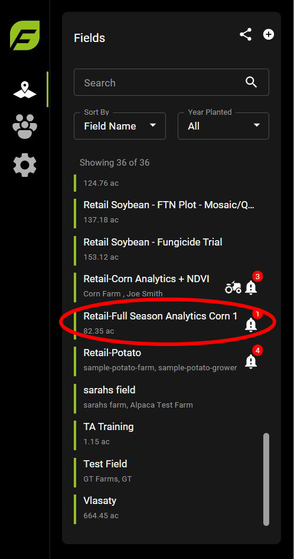

# FieldAgent - Exporting Map Layers

## Map Layers  

FieldAgent uses different file types to display different types of map layers. These Include:

<table data-full-width="false"><thead><tr><th>Map Type</th><th>File Type</th></tr></thead><tbody><tr><td>Orthomosaic</td><td>GeoTIFF</td></tr><tr><td>Quicktile</td><td>GeoTIFF</td></tr><tr><td>Stand Count</td><td>Shapefiles*</td></tr><tr><td>Tassel Count</td><td>GeoJSON</td></tr><tr><td>Field Boundaries and shapes</td><td>Shapefiles*</td></tr><tr><td>Plot Trial</td><td>GeoJSON &#x26; CSV</td></tr></tbody></table>

 <mark style="background-color:blue;">\*Shapefiles are comprised of 5 different files. Make sure you download each file.</mark>&#x20;

### Exporting Map Layers From FieldAgent Web 

1\. Select the Field you want to export.

<figure><figcaption></figcaption></figure>

2\. Open the Map Layers section

<figure><figcaption></figcaption></figure>

3\. Click the name of the survey to open the layer details section.&#x20;

<figure><figcaption></figcaption></figure>

 <mark style="background-color:blue;">Clicking the circle to the right of the name will display the map layer, make sure you click the name to open the details section.</mark>

\
4\. Scroll to the bottom where you'll find the Download Files section.\
5\. Click the download icon for each file.

<figure><figcaption></figcaption></figure>

 <mark style="background-color:blue;">Shapefiles have multiple files to download, make sure you download every file.</mark> \

### Exporting Map Layers From FieldAgent Desktop 

1\. Select the field you want to export from.&#x20;

<figure><figcaption></figcaption></figure>

2\. Select the survey date that you want to export map data from. Maps captured on that date will now populate in the Images Layer.

<figure><figcaption></figcaption></figure>

3\. Click the gear icon next to your map layer and select export from the drop down menu.

<figure><figcaption></figcaption></figure>

4\. Choose the export location and press OK. Depending on your map type, you will also download the Images used to create your map.&#x20;

### Exporting Field Boundaries From FieldAgent Desktop  

 <mark style="background-color:blue;">Field Boundaries can only be exported from FieldAgent Desktop. Field boundaries created in FieldAgent Web or Mobile can be accessed on Desktop, once they have been synced.</mark>&#x20;

\
1\. Select the field you want to export

<figure><figcaption></figcaption></figure>

2\. Click the gear icon next to your desired boundary in the shape section. Select export from the drop down menu.

<figure><figcaption></figcaption></figure>

3\. Choose the export location and press OK.
