# FieldAgent - Importing Images

Images can be imported into FieldAgent on both the Web and Desktop. After syncing to the Cloud, imagery will be viewable in FieldAgent on Web, Desktop, and iOS.

<mark style="background-color:green;">Advantages to both options:</mark>

* <mark style="background-color:green;">Importing into FieldAgent on Desktop does not require a previously created Field Boundary and allows users to import into multiple fields at once.</mark>
* <mark style="background-color:green;">Importing into FieldAgent on the Web does not require a Windows PC.</mark>

## Viewing Permissions 

Imagery can be seen by:

* The account that uploaded the data.
* Accounts that have access to the field the imagery was uploaded to.

## Importing on the Web (Mac friendly) 

To import on the Web:

1. In a Web browser, navigate to [FieldAgent.Sentera.com](http://fieldagent.sentera.com/).
2. [Navigate to the field](https://support.sentera.com/portal/en/kb/articles/navigating-to-a-field) you would like to import imagery into. If the field has not yet been created, [create the field](fieldagent-create-edit-and-delete-a-field-boundary.md).
3. Click + to the right of Map Layers on the field page.

<figure><figcaption></figcaption></figure>

4. Drag and drop photos from your flight into FieldAgent.
5. Click Upload and wait for your images to upload. You'll receive an email when your images have finished processing.

<figure><figcaption></figcaption></figure>

## Importing on Desktop 

To import images on FieldAgent for Desktop:

1. Open FieldAgent Desktop and click **CREATE SURVEYS** in the top right corner.

<figure>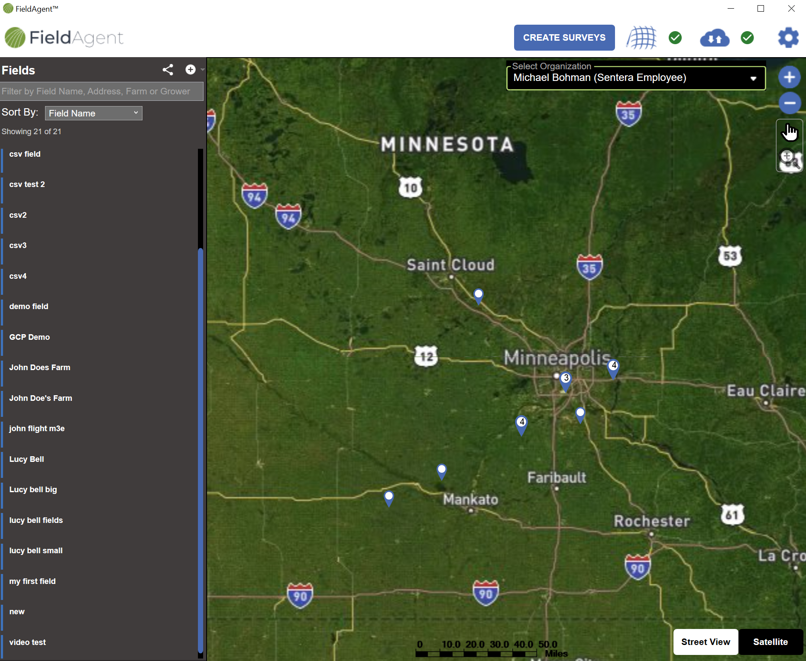<figcaption></figcaption></figure>

### Image Survey Selection 

&#x20;     1\. Drag and drop your image folders or click BROWSE to select your image folder location.

<figure>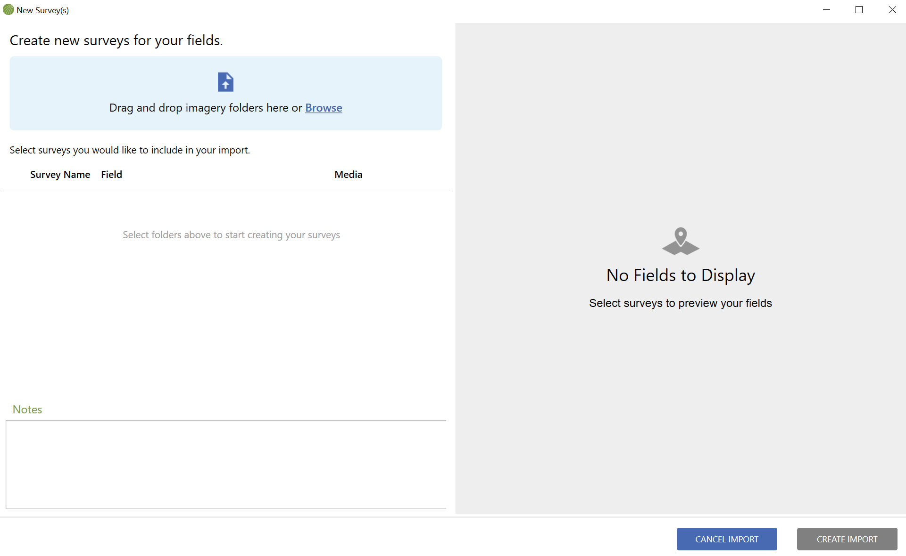<figcaption></figcaption></figure>

If using **BROWSE**, click **SELECT FOLDER** when you have selected your image location

<figure>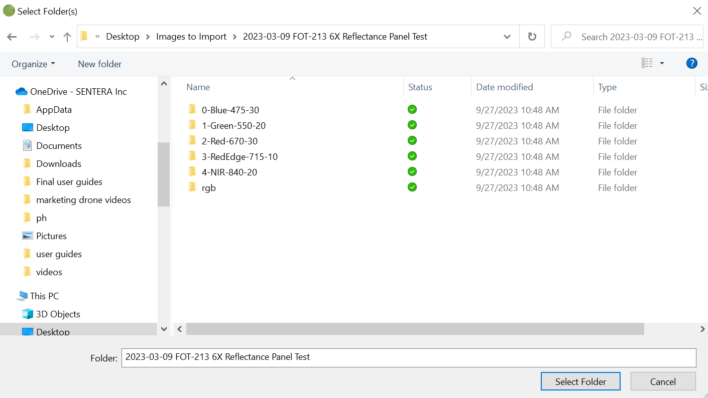<figcaption></figcaption></figure>

>  <mark style="background-color:yellow;">NOTE: FieldAgent Desktop will look for images two subfolder levels deep. This means you can select a folder which contains folders full of images. If your imagery did not load after clicking SELECT FOLDER, check that your subfolders contains images.</mark>

2\. Wait for your images to process and for FieldAgent to build a map on the right side of the screen.

<figure>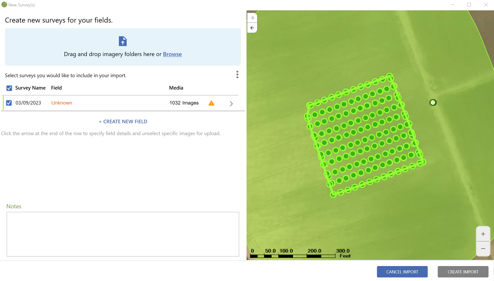<figcaption></figcaption></figure>

3\. You can add more image surveys by importing additional folders at any time.

<figure>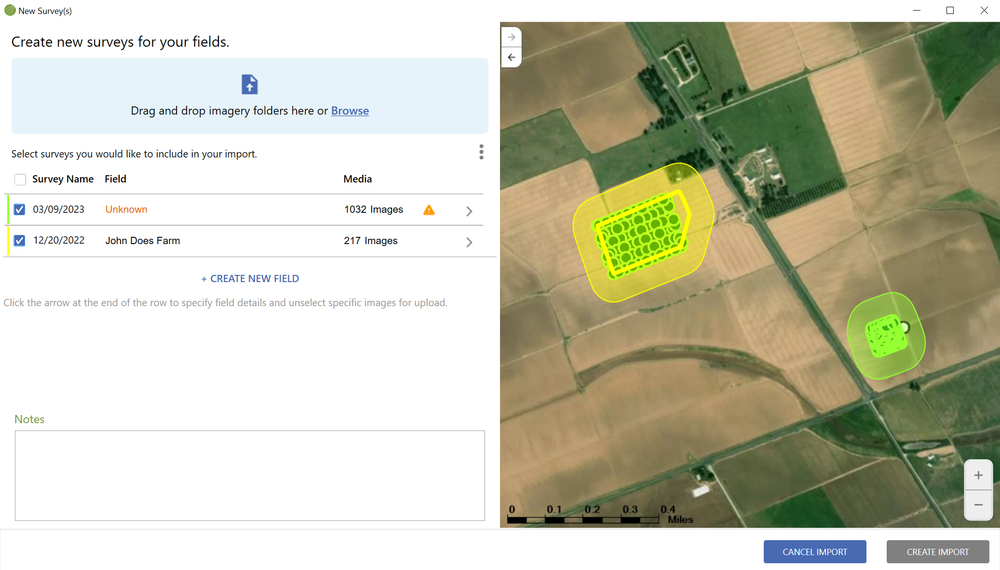<figcaption></figcaption></figure>

 <mark style="background-color:yellow;">NOTE: Toggle whether to import a survey by clicking the check box next to the survey name</mark>

### New Field Creation 

If you do not have a field boundary for your image survey, FieldAgent will begin to create one for you. New fields will show up with a field name of UNKOWN and will have a yellow warning icon.&#x20;

<figure>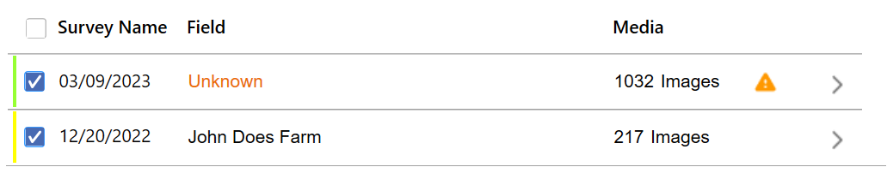<figcaption></figcaption></figure>

To finish creating a new field:\
&#x20;     1\. Click the **Arrow Icon**  by the yellow warning icon to finish setting up a new field\
&#x20;     2\. Only a Field Name is required to complete setting up your field. You can also add grower and farm information on the left side of the screen.

<figure>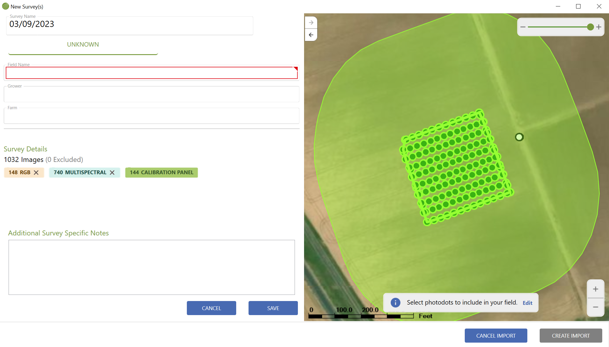<figcaption></figcaption></figure>

3\. Optionally, you can edit the field boundary on the right side of the screen. Click EDIT to begin the process.

<figure>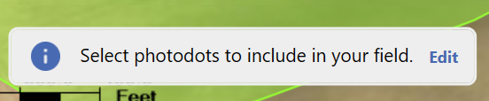<figcaption></figcaption></figure>

The field boundary is shown by the blue shape which surrounds the image dots.

<figure>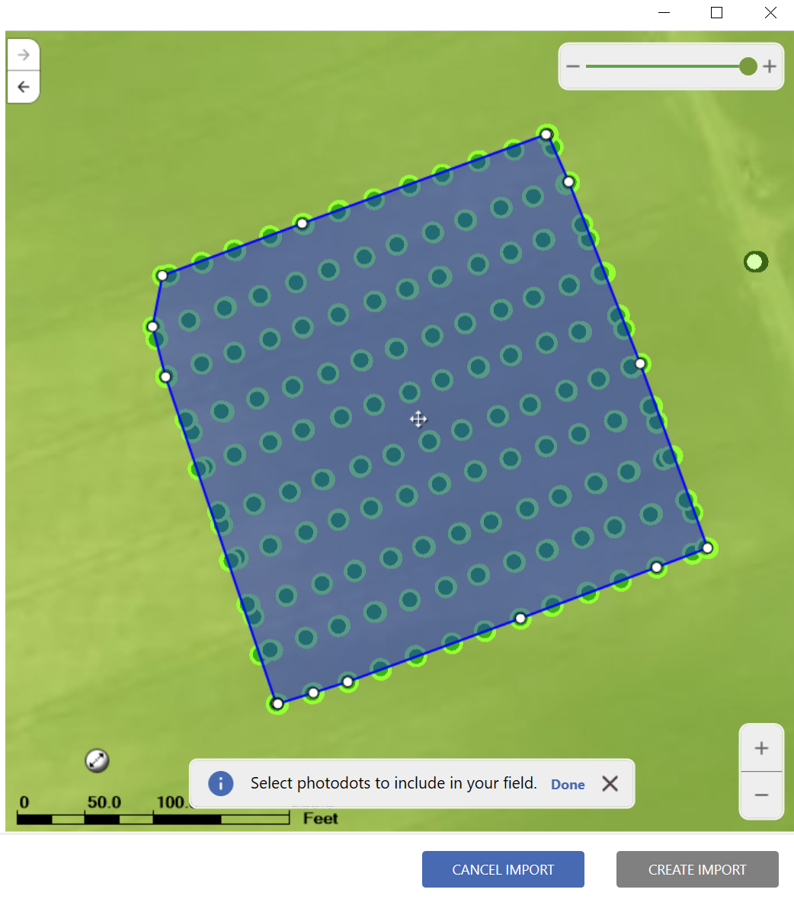<figcaption></figcaption></figure>

To edit the field boundary:

&#x20;• Use the straight arrow button    to shrink and expand the shape of your field boundary.

• Use the curved arrow button  to rotate the shape of the field boundary.

• Use the cross hairs  at the center of your field to move the boundary.

• Click and drag any of the white dots around the end of the field to change the shape itself.

• Click on the edge of the field to add more dots.

• Select DONE When you’re finished editing the field boundary.

<figure>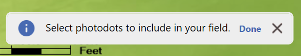<figcaption></figcaption></figure>

4\. Click **SAVE** on the left side of the screen to finalize your new field. \
&#x20;           

### Import Settings

1\. Click the **three dots**  above the survey information to change import settings for all surveys.

2\. Toggle any setting to turn it on or off.&#x20;

3\. Optionally, add notes at the bottom of the page. These notes will be connected to every survey imported in this session.

<figure><figcaption></figcaption></figure>

### Survey Settings 

1\. Click the Arrow Icon   in the Survey information section, to adjust settings for each individual survey.

<figure><figcaption></figcaption></figure>

2\. Under survey details, click the X button to remove an image type from the import           &#x20;

<figure>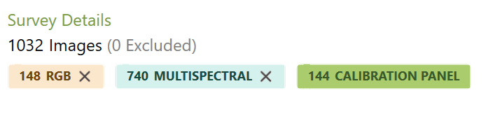<figcaption></figcaption></figure>

3\. Click the + button to add the image type back into the survey.

<figure>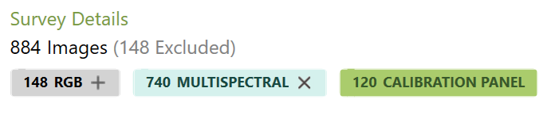<figcaption></figcaption></figure>

4\. Adjust the Image Select Buffer by using the slider in the top left corner.

<figure>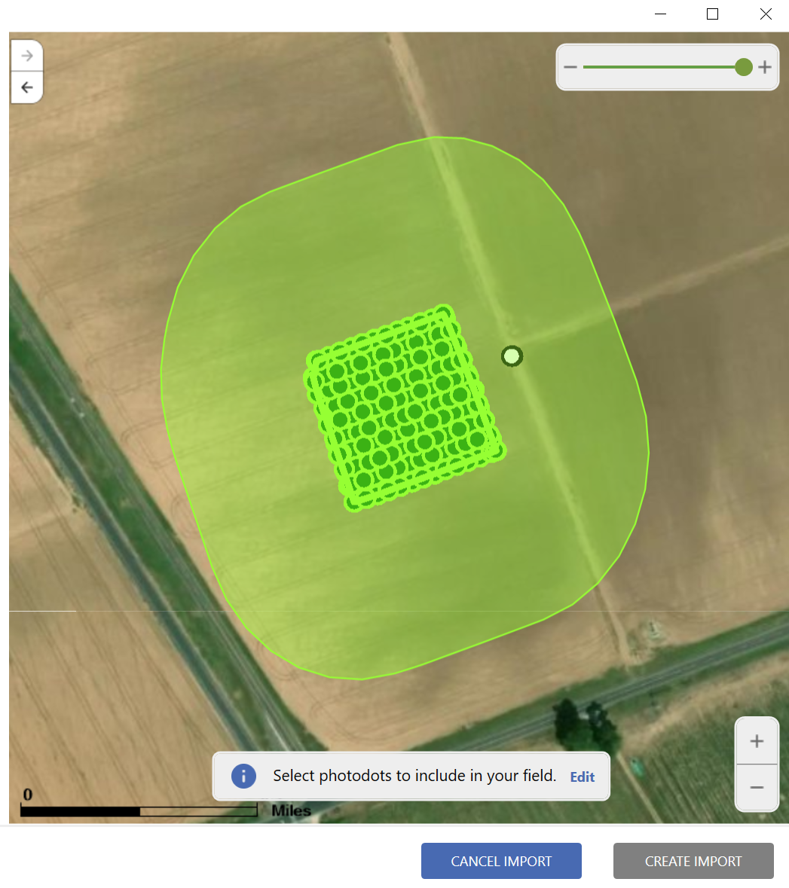<figcaption></figcaption></figure>

\
 <mark style="background-color:yellow;">NOTE: The image select buffer is shown by the shaded area around the field boundary. The buffer can be between 0 ft and 300 ft. By Default, its set to 300ft which means that any image dot within 300 ft of the field boundary will be included in this survey.</mark>

\
&#x20;        Green Dots mean the image is included, Red dots mean the image is excluded, and white dots are the calibration panel images. Calibration Panel Imagery will import regardless of whether its within the selection buffer.

<figure>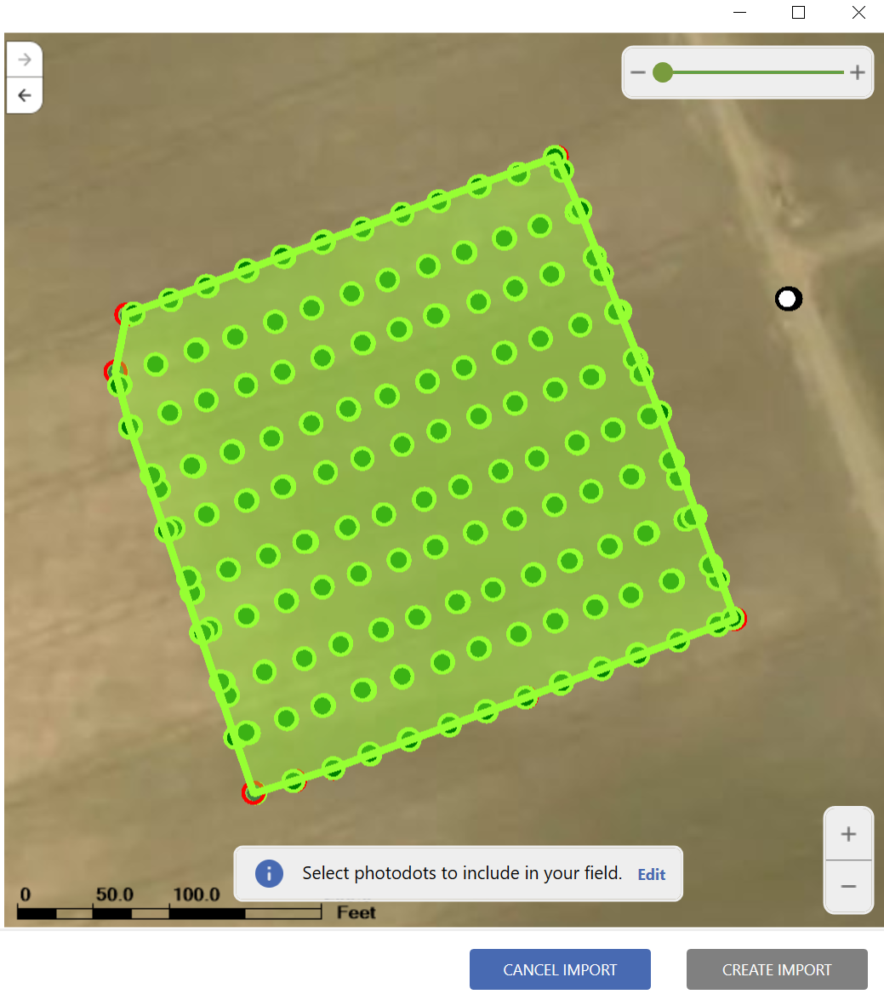<figcaption></figcaption></figure>

Clicking on a dot will toggle it between green and red.

\
5\. Click **SAVE** on the left side of the screen to confirm your survey settings.

<figure><figcaption></figcaption></figure>

6\. Click **CREATE IMPORT** on the right side of the screen to finish the import process.

<figure>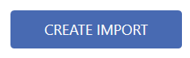<figcaption></figcaption></figure>

