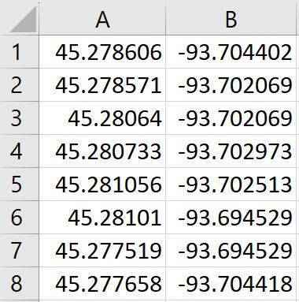

# FieldAgent Mobile - Create a field and flight plan with a CSV file

CSV Files can be imported into FieldAgent Mobile by choosing to open the file with “FieldAgent” on you iPad. These CSV Files of GPS points can be used to create a Flight Plan and or even a new Field.

## CSV File Format 

* GPS points must be written in decimal degrees format.&#x20;
* Your CSV file must include two columns. Latitude values go into column A, and Longitude values go into column B.

<figure><figcaption></figcaption></figure>

* Each row is a pair of latitude longitude points. The order of these pairs dictates how your field boundary is drawn. This Image shows the field boundary created from the CSV file above. Each numbered point on the field corresponds to the same numbered row in the CSV file.&#x20;

<figure><figcaption></figcaption></figure>

* List your GPS points in a clockwise or counterclockwise pattern around your field. Going out of order can create strange field shapes such as the field shown below. This field boundary was created by swapping rows 4 and 7 in the original CSV file shown above.

<figure><figcaption></figcaption></figure>

### Importing a CSV 

1\. Select the .CSV file on your mobile device

<figure><figcaption></figcaption></figure>

2\. Choose to open the file with FieldAgent

<figure><figcaption></figcaption></figure>

3\. The CSV will open up as a flight plan over a new field.

<figure><figcaption></figcaption></figure>

## Creating a Field 

1\. To save the field click the settings wheel in the top right corner.

<figure><figcaption></figcaption></figure>

 <mark style="background-color:yellow;">Note: Only the field boundary will be saved. Flight parameters will need to be reentered for future flights.</mark>

\
2\. Click Create a Field

<figure><figcaption></figcaption></figure>

3\. Name your field and click OK.

<figure><figcaption></figcaption></figure>

4\. Click Upload. The field will be saved and uploaded to FieldAgent. This Field will be visible in all FieldAgent clients.

