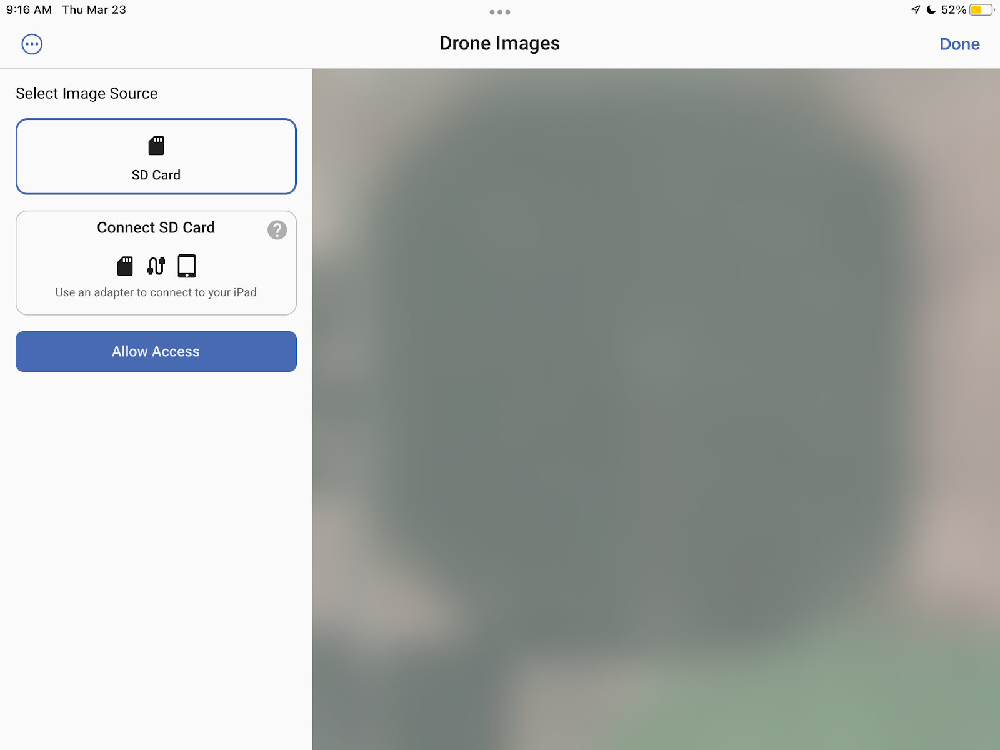

# FieldAgent - Mobile Stand Count

## Overview 

<figure><figcaption></figcaption></figure>

The Mobile Stand Count feature for FieldAgent Mobile (iOS app) is intended for quickly processing shareable Stand Count results from the field’s edge. The video below shows it populating in real time:&#x20;

<figure><figcaption></figcaption></figure>

A map result will be shareable immediately after processing. Sharing options include text message, iMessage, email, and any other iOS supported applications.

\
Mobile Stand Counts processed on FieldAgent for iOS are run through the same steps as FieldAgent Web and Desktop and thus users can expect the same results.

\
 <mark style="background-color:yellow;">NOTE: Stand Count on FieldAgent Mobile (iOS app) will not upload the underlying imagery associated with each numbered disc on the map. To attach imagery to the numbered discs, Stand Count must be</mark> <mark style="background-color:yellow;"></mark><mark style="background-color:yellow;">**reprocessed**</mark> <mark style="background-color:yellow;"></mark><mark style="background-color:yellow;">using FieldAgent on Web or Desktop.</mark>

***

## Requirements

Although there are a few requirements for processing Mobile Stand Counts with FieldAgent Mobile, it is worth noting that **online connectivity is NOT a requirement to generate a stand count\*!** &#x20;

### FieldAgent Subscription Type 

Stand Count on FieldAgent Mobile (iOS app) requires users to have an **Enterprise, Advisor Standard, or Advisor Premium License.**\
\
 <mark style="background-color:blue;">For more information on pricing, view</mark> [<mark style="background-color:blue;">our pricing page</mark> ](https://sentera.com/agronomic-analytics/)<mark style="background-color:blue;">.</mark>

### Sensor

The following sensors are supported:

* Sentera Double 4K Analytics on a DJI M300 or Sentera PHX
* DJI Phantom 4 Pro V2 built in RGB Sensor
* DJI Mavic 2 Pro built-in RGB Sensor
* DJI Mavic 3 Enterprise built-in RGB Sensor

| Sensor                        | Flight Altitude |
| ----------------------------- | --------------- |
| Sentera Double 4K - Analytics | 150ft           |
| DJI Mavic 2 Pro               | 50 ft           |
| DJI Phantom 4 Pro V2          | 50 ft           |
| DJI Mavic 3 Enterprise        | 50 ft           |

### iOS Device

**Mobile Stand Count only works on iPads** . The newer the iOS device, the faster Stand Counts will process.  You will also need a microSD card adapter that is compatible with your iPad.

### Crop Types 

* Corn
* Cotton
* Potato
* Soybeans

### Crop Size

Plants should be at least 4 inches leaf across, leaf tip to leaf tip. Rowfill mode will be used when plants within a row are touching. Stand Counts can not be performed when the space between rows is covered by crop canopy.

### Uploading (\*online connectivity) 

The iPad that is generating Mobile Stand Counts must be connected to the internet in order for Stand Count results to be uploaded to the cloud and accessible on the Web and Desktop. A field must also be selected when running Stand Counts so that the Stand Counts have somewhere to upload. File sizes on Stand Counts are designed to be extremely small, so as not to interfere with low data caps or connections in areas with slow connectivity.

***

## How to use

### Flight Planning for DJI Drones on FieldAgent Mobile  

After setting an area or line, and camera:&#x20;

Choose the **Stand** preset. This will set the correct altitude for your camera and set the overlap to capture at \~1 stand count per acre.

<figure><figcaption></figcaption></figure>

The boundary buffer for Stand Counts is set to 100ft. This will cause Stand Counts over small fields (less than 50 acres) to have much less than one Stand Count per acre. Lowering the boundary buffer (as it is safe to do so) will allow the drone to fly closer to the edges of the field and thus capture more of the field.\
\
  <mark style="background-color:red;">WARNING: DJI Mavic and Phantom drones are set to fly at 50 feet in order to collect the imagery with the correct resolution. Use caution when flying at low altitudes.</mark>

### Non-Flat Terrain and Obstacles 

When flying over non-flat terrain, [Terrain Informed ](https://support.senterasensors.com/fieldagent-mobile-ios/60-second-guides/terrain-informed-flight)Flight Planning should be turned on as well. Note that while processing Mobile Stand Counts does not require an internet connection, planning a terrain informed flight DOES require an internet connection.

<figure><figcaption></figcaption></figure>

 <mark style="background-color:red;">WARNING:  Concave flight boundaries with surrounding trees should be replanned as line missions.</mark>

Look closely at planned flight routes before pressing launch. Some flight patterns over concave flight boundaries may cut through the boundaries. Cutting through the boundary is the most efficient path, but not the safest.\
\
To solve this problem, clear the flight plan and, in the order the drone can safely fly, select all the locations where you would like to capture an image for Mobile Stand Count. Planning flights in this manner also makes it less likely that images are captured over areas where a Stand Count may not be possible (i.e., over terracing or irrigation channels). See below for an example of a custom planned line flight that ensures the drone will not cross over trees while capturing photos.

### Running Mobile Stand Count 

1. After flight, remove the SD Card from your sensor or drone and insert into an SD card reader attached to your iOS device.&#x20;

<figure><figcaption></figcaption></figure>

2. From the Home Screen, tap the menu option for Dashboard and select **Review Drone Imagery**
3. Select **Allow Access.**

<figure><figcaption></figcaption></figure>

4. When prompted, select the SD Card in the finder window and then click **Done** .  FieldAgent will automatically search the SD Card for flights. Flights will be organized by date and time with the most recent flights on top.

<figure><figcaption></figcaption></figure>

 <mark style="background-color:blue;">Unless necessary, select the SD Card name and not a lower level folder.</mark>

5. Select the flight you’d like to run a Mobile Stand Count and then select **Create Report** at the bottom of the screen. If necessary, deselect or other non-RGB takeoffs.

<figure><figcaption></figcaption></figure>

6. Confirm the properties and edit as necessary.

<figure><figcaption></figcaption></figure>

&#x20; <mark style="background-color:blue;">U</mark><mark style="background-color:blue;">ploading results to the cloud requires a field selection. Click Field and choose from your list of fields. You may need to switch organizations to find an existing field.</mark>&#x20;

<figure><figcaption></figcaption></figure>

7. Once you’ve confirmed the properties, select **Start**.&#x20;

## Viewing and Analyzing Results 

After analyzing a subset of images results will begin to populate on the screen quickly! This video below shows the process in real time:

<figure><figcaption></figcaption></figure>

### Progress Bar 

A progress bar at the bottom of the screen provides an estimate for how much time remains in processing the selected Mobile Stand Count images.

<figure><figcaption></figcaption></figure>

### Numbered Discs 

As images are processed, discs will appear on the screen in place of the white photo-dots at each image location.

<figure><figcaption></figcaption></figure>

Each Stand Count disc displays the detected number of plants per acre and is colored according to how that number compares to the other Stand Counts on the screen. Dark green indicates a higher Stand Count, red indicates a lower Stand Count.

\
Recoloring of discs happens in real time. In the example below, a Stand Count in the lower right turns from red to orange as more images are processed.

 ---> 

The discs can be selected to preview the image at that location. Select a disc and then press the magnifying glass to preview the annotated image at that location full screen.

\
                                      &#x20;

## PDF Report 

Stand Counts can be shared as a PDF report after processing.\
\
1\. Click edit report to open the PDF editing feature and share.\
2\. Click the **Add Notes** section and type in any notes you’d like to add to the report.

<figure><figcaption></figcaption></figure>

3\. When you are done, **click the Share Icon** in the upper right corner and share using your preferred sharing method.

## Accessing Previously Created PDF Reports 

1. Click on the **gear settings** icon from any page in the mobile app and then **My Past Surveys** .
2. Select **My Stand Counts.**

<figure><figcaption></figcaption></figure>

3\. Select the survey date you’d like to view.

<figure><figcaption></figcaption></figure>

4\. Share the report using the share icon in the lower right corner.

<figure><figcaption></figcaption></figure>

## Sharing to the Cloud 

 <mark style="background-color:blue;">Underlying images will not be uploaded to the cloud. Make sure you import your images to FieldAgent to save and sync the data.</mark>

Sharing to the cloud happens automatically  **when a field was selected before processing and the iPad was connected to the internet when processing was completed.**

Access Stand Counts generated by FieldAgent Mobile in the Web or Desktop by visiting the field page that the Stand Count was associated with and viewing the map layers.

<figure><figcaption></figcaption></figure>
