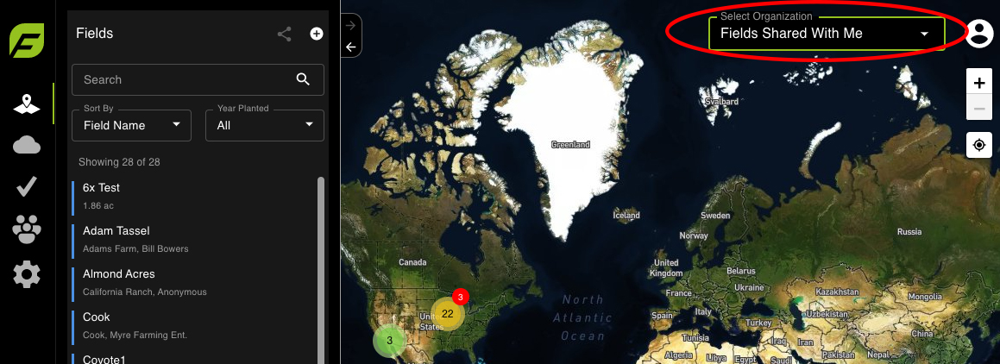

# FieldAgent - Share a Field

Fields can be shared with any email address. If the email is associated with a FieldAgent account, the share will last indefinitely. If the email is not associated with a FieldAgent account, the share will last for 365 Days.

A video guide can be found at the end of this article.

 <mark style="background-color:yellow;">Note: Once you import imagery to a field that is not in your home organization, but it is in a partner organization or another part of the hierarchy, you can share the field to yourself, which enables you to see mosaics and tassel counts ordered and produce PDF reports.</mark>

## FieldAgent Desktop 

### Share a Field 

1. Open FieldAgent Desktop, to share all fields, click the share icon; to share just one or a few fields, search by field name and select it. Click Yes to confirm the share.
2. Enter the email address to share fields and then click Share.
3. Click OK. The recipient will receive an email stating a field has been shared with them. This share will be in effect for 365 days.
4. For a permanent share of a field, open the field to share, click the share icon from the toolbar at the top of the field window.

 <mark style="background-color:yellow;">Note: To receive the permanent shared field, the recipient must be a registered FieldAgent user.</mark>

5. Enter the email address and then click Share.&#x20;
6. Click OK. The recipient will receive an email stating a field has been shared with them. Shared fields can be access under the "Fields Shared With Me" organization. It will be visible to them until you decide to turn off the share.

<figure><figcaption></figcaption></figure>

### Stop Sharing a Shared Field  

1. Click the gear icon from the upper right-hand corner of the window.
2. Select Settings. The Settings dialog box opens.&#x20;
3. Click the Share tab. A list of shared fields displays.&#x20;
4. Select the shared field, from the Options area click Revoke, click the x next to the name to remove access.&#x20;
5. Click Save.&#x20;
6. A Success dialog box displays. Click Close.

## FieldAgent Web 

### Share a Field 

 <mark style="background-color:yellow;">Note: All fields shared within FieldAgent Web are a temporary share for 365 days.</mark>

1. Open FieldAgent Web.&#x20;
2. From the Fields menu, to share all fields, click the share icon; to share just one or a few fields, search by field name and select it. Click Yes to confirm the share.
3. Enter the email address to share fields and then click Share.&#x20;
4. Click OK. The recipient will receive an email stating a field has been shared with them. This share will be in effect for 365 days. &#x20;
5. If the recipient's email is connected to a FieldAgent account, they can access shared fields by changing their organization to "Fields Shared With Me"

<figure><figcaption></figcaption></figure>

6. If the recipient's email is not connected to a FieldAgent account, they can access shared field by clicking the link in the email. Without a FieldAgent account the recipient is only able to view the field.

<figure><figcaption></figcaption></figure>

 <mark style="background-color:yellow;">Note: You are unable to delete fields shared within FieldAgent Web. You can only do this on FieldAgent Desktop</mark>

### Delete a Shared Field 

1. To delete a share, log into FieldAgent Desktop and follow the instructions in the previous process.
2. Click the gear icon from the upper right-hand corner of the window.
3. Select Settings. The Settings dialog box opens.&#x20;
4. Click the Share tab. A list of shared fields displays.&#x20;
5. Select the shared field, from the Options area click Revoke, click the x next to the name to remove access.&#x20;
6. Click Save.&#x20;
7. A Success dialog box displays. Click Close.

### Field Share Video Guide 


