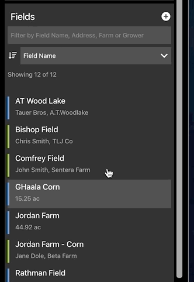

# FieldAgent Web - Navigating to a Field

There are multiple ways to navigate to a saved field in FieldAgent.\
\
1\. Search for the field using the left hand search bar.

<figure><figcaption></figcaption></figure>

2\. Click on field pins to explore your map and navigate to the desired field.

<figure><figcaption></figcaption></figure>

Field Boundaries will show on the map when zooming.

<figure><figcaption></figcaption></figure>

3\. Scroll through your list of fields on the left hand side of the screen.

<figure><figcaption></figcaption></figure>

* If you have many fields, it may helpful to filter the list as shown below.

<figure><figcaption></figcaption></figure>

