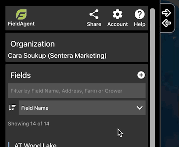
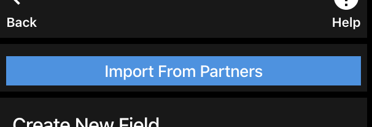
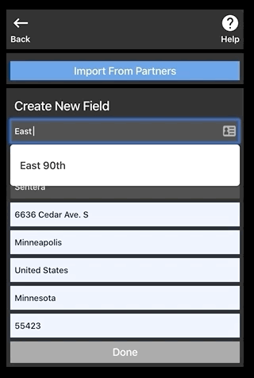
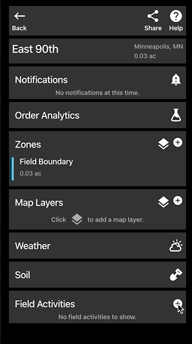

# FieldAgent Web - Tassel Count: End-to-End Walkthrough

#### Visit [FieldAgent.sentera.com](https://fieldagent.sentera.com/) 

BEFORE PROCEEDING, PLEASE NOTE THE FOLLOWING:

\
 <mark style="background-color:red;">CAMERA FIRMWARE: Ensure your Sentera camera has the latest firmware version.</mark>

\
 <mark style="background-color:red;">PLANT SIZE: For best results, ensure the tassels are developed and their individual branches are visible.</mark>&#x20;

### Create a Field 

If the field you wish to perform tassel count on is not yet in your FieldAgent account, select the plus button at the top right of the Fields list.

<figure><figcaption></figcaption></figure>

Select-click out the boundaries of your field as shown below, or select to import boundaries from another application.

<figure><figcaption></figcaption></figure>

Option to import boundaries from a Partner application shown below.

<figure><figcaption></figcaption></figure>

Name the field, fill out all of the field details, and click Done.\
 <mark style="background-color:green;">TIP: Enter the address to will allow for easy directions in the future on FieldAgent Mobile.</mark>

<figure><figcaption></figcaption></figure>

### Create a new Field Activity

Ordering analytics requires a Field Activity to make calculations. To create a new Field Activity, click the + icon to the right of Field Activities on the Field Page.\
Select or create a new crop season as necessary. Enter information in the activity type (plant), planting date, average planting rate, units, and row spacing. Seed variety and Maturity Group are optional. Finally, click Save.

<figure><figcaption></figcaption></figure>

### Upload a New Map Layer 

Click + to the right of Map layers on Field page.\
Drag and drop photos from your flight into FieldAgent.\
Click Upload and wait for your images to upload. You'll receive an email when your images have finished processing.

<figure><figcaption></figcaption></figure>

### Order Analytics 

Within your field, select Order Analytics and fill out the page as necessary. Select Order. You'll receive an email when your order has been processed. This should not take more than 48-72 hours, but may depend on your internet connection.

<figure><figcaption></figcaption></figure>

### Verify Results 

You can quickly verify the accuracy of our tassel count algorithms by clicking on the dots shown on the screen. This will display the photo used at that location on the map.\
Chose Annotation in the top right to display the bounding boxes around each plant used in the calculations.  If you have questions please reach out to Sentera Support.

<figure><figcaption></figcaption></figure>

<figure><figcaption></figcaption></figure>

