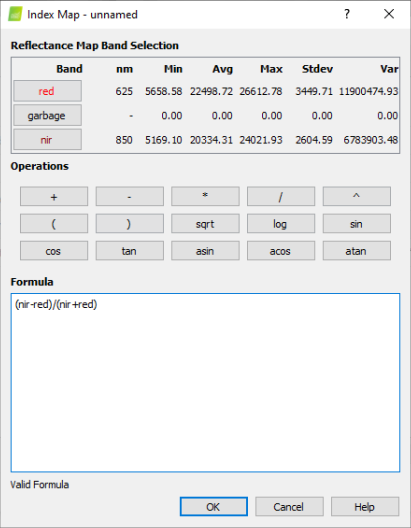

# Pix4D - Adding Single Sensor Pix4D Templates (NDVI and NDRE)

The instructions and templates below will help you use **Pix4D (Version 4.5.2)** with your Sentera Single Sensor. Make sure to download the correct template for your sensor. Using the incorrect template will produce inaccurate results. If you are not sure what type of sensor you have, contact us at [support@sentera.com](mailto:support@sentera.com). We will need the model and serial number located on the label that is on the sensor.\
\
**If you have an older version of Pix4D with the "sentera\_single\_precision\_ndvi\_2018\_01\_22" or "sentera\_single\_precision\_ndre\_2018\_01-22" template please follow the instructions below.**

**Updating the Template for an older version of Pix4D to support the Single Sensor Firmware 2.3.2 or higher (Late January 2020).**

1\.     Run the project as you normally would with the old template.  When the project is done, click on Index Calculator.

<figure><figcaption></figcaption></figure>

2\.     Check to see if the NDVI and NDRE indices are present in the dropdown. If missing, click Indices and continue to Step 3.&#x20;

<figure><figcaption></figcaption></figure>

3\.     Click Add to create a new Index.

<figure><figcaption></figcaption></figure>

4\. Type in the correct formula for the Sensor and click OK.\
&#x20;     _Note: You can only use the formula that is valid for your sensor type._     &#x20;

&#x20;     **NDVI** = (nir-red)/(nir+red)\
&#x20;     **NDRE** = (nir-red\_edge)/(nir+red\_edge)

<figure><figcaption></figcaption></figure>

5\.  Give the index a meaningful name. Keeping in mind if this is an NDVI or NDRE sensor.  For example, Single Sensor NDVI.&#x20;

<figure><figcaption></figcaption></figure>

6\. Select the Index and click Generate.

<figure><figcaption></figcaption></figure>

**Downloads:**














